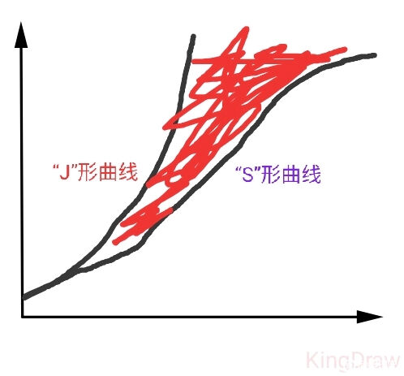

# 关于普通高中学生邋遢现象的研究
## 前言
就在 2020 年 12 月时，我换了同桌，我们俩都是比较邋遢那种，然后因为地面有杂物，桌面不整洁等等原因经常被扣分。然而在我们俩同桌的这段期间，我发现，假如他更邋遢，我就会主动去收拾桌面地面，假如我更邋遢，他就会去收拾，这是为什么呢？因此我对比进行了研究。

## 邋遢值/邋遢密度
指单位面积（体积）内杂物的量，因为与密度有相似之处，所以又称邋遢密度。表达式为 $\rho=n/v(s)$。邋遢密度等于杂物的量除以调查邋遢密度的体积或面积。根据你想要调查的是平面上的邋遢密度还是空间中的邋遢密度，选择除以面积或体积。

## 调查邋遢密度的方法
一般情况下使用样方法，在被调查杂物的分布范围内，随机选取若干个样方，通过计数每个样方内的杂物个体数，求得每个样方的邋遢密度，以所有样方邋遢密度的平均值作为该地点的邋遢密度估值。

对于正方形地块，需要用五点取样法，对于长形地块（如走廊等），需要用等距取样法。

然而这只适用于活动能力差，活动范围小的杂物。对于活动范围大，活动能力强的杂物，我们需要使用标记重捕法。

对于具有趋光性的杂物，还可以使用黑光灯诱捕法。

## 实验结果
在理想条件下，即空间足够，没有天敌（指政教扣分，班主任检查等），杂物有恒定来源的情况下。杂物的量会成 J 形曲线增长，但是由于种种因素限制，往往杂物的量达到一个限度，就不再增长了。这个限度我们称之为“邋遢容纳量”，指一定条件下能够维持杂物不被清理的最大的量。

一般情况下，达到邋遢容纳量时，在一定空间内，邋遢值是不会出现明显增加或减少的，一般会在一定范围内波动。经证实，这个范围叫做邋遢平衡常数，是该地点的邋遢容纳量与体积/面积的比值。表达式为 $K_H=K/v(s)$，н 取自俄语“邋遢”（неряшливый）的首字母。邋遢平衡常数的定义式如下：

$$
K_H = \frac{n(A)\cdot n(C)}{n(B)}
$$

其中 $n(A)$ 表示现在该地点杂物的量，$n(C)$ 表示增长的杂物的量。$n(B)$ 表示初始该地点杂物的量。

	
	 
    

    红色部分为由于政教扣分，班主任斥责，或影响正常学习生活而被清理掉的杂物。
  	

## 影响邋遢平衡的因素
已知平衡“不邋遢↹邋遢”

1. 空间大小：空间增大，邋遢平衡正向移动，空间减小，邋遢平衡逆向移动。
	
	空间增大，可容纳的杂物增加，平衡正动，导致空间减小。

	空间减小，为了留出可用空间，必须减少杂物的堆放，平衡逆动，导致空间增大。

2. 检查强度：检查强度增大，邋遢平衡逆向移动，检查强度减小，邋遢平衡正向移动。

	检查强度增大，为了防止扣分，必须减少杂物堆放，平衡逆动，政教看杂物并不多，会减弱检查力度。

	检查力度减弱，没人制约，可堆放更多杂物，平衡正动，政教看杂物多了，会增强检查力度。

3. 邋遢密度：邋遢密度增大，邋遢平衡逆向移动，邋遢密度减小，邋遢平衡正向移动。

	邋遢密度增大，受制约因素所限，平衡逆动，杂物的量减少，邋遢密度减小。

	邋遢密度减小，并没有达到邋遢容纳量，平衡正动，杂物的量增大，邋遢密度增大。

这就是邋夏遢列原理。

2021 年 1 月 1 日，<a href="https://tieba.baidu.com/p/7176701454">原文链接</a>

