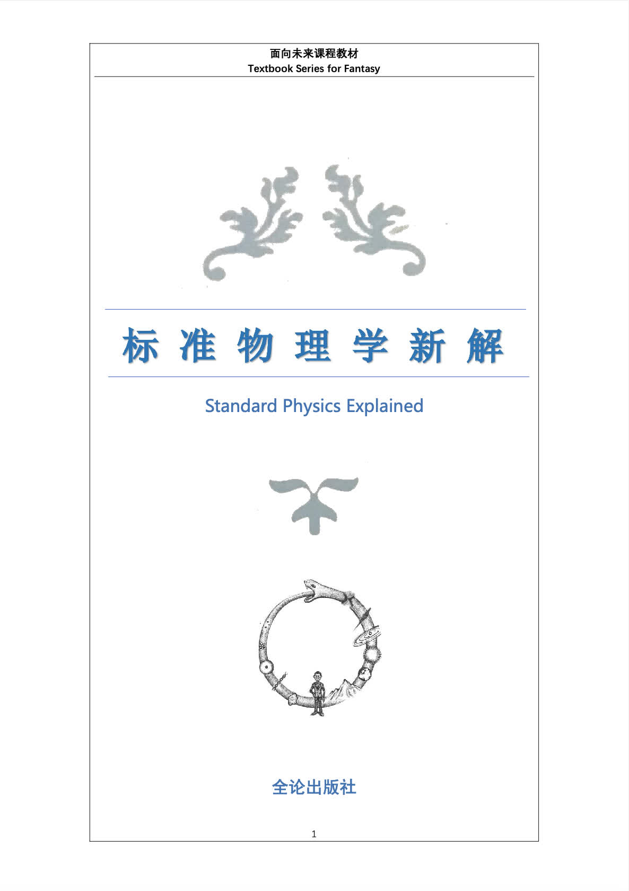

# 标准物理学新解

本书由 @终端激波 主编，出版于 2022 年，由 @超盐酸钠 重新排版并收录进超理图书馆。

## 序
——写在本书之前

标准物理学的发展已经有较长的时间了，去年的艺术节，我有幸见到了《标准物理学》一书，开始对此产生浓厚的兴趣，经过对此书的完整阅读和认真思考，感受到这本书所具有的高深思想，对其中一些稍有缺漏或较难理解的内容感到遗憾，认为这样伟大的著作不应当止步于此，而应继续进行发展。经过再三思量，并询问《标准物理学》的几位编者之后，我决定开始创作《标准物理学新解》(以下简称《新解》)。

对于《新解》一书，我的初步规划是对原书中一些仅仅寥寥几笔带过的内容进行更为详细的介绍，主要包括原书中所提到的动态宇宙论、标准相异率、纯论、宇宙价键论以及广义化的标准物理学等等内容。在实际成书过程中，为了能够定量描述所讲的内容，我又引入了一些其它定律，使得各个理论之间能够结合的更为紧密，并能够将其运用到一些其它方面的学科，如玛吉克化学等，从而使得这个标准物理学的体系更为完整更加丰富。

《新解》一书由四章组成，分别讲解了动态宇宙定律及其运用、α 宇宙的进一步探究、膨胀的宇宙以及外宇宙的探索。在部分章节后由用黑色笔书写的课后习题及相关提示，可以供教学者进行参考。一些较为重要的定义或名词也同样使用黑色进行加深，这能够使得读者对其中一些概念有着更为清晰了解。对于个别有难度的章节，在章节符号之前我们会加上“★”作为标记表示其为拓展章节，可以供学有余力的读者进行学习。

感谢各位读者对本书编写的支持，若读者发现本书中的一些错误或纰漏，以及对本书编写提出宝贵意见，请百度贴吧私信作者，我们将及时进行修改，使本书趋于完善。

编者：终端激波 2022.11.08

在编写本书的过程中，我们编写组得到了很多老师和同学的帮助，在此一并致谢！

## 名家评论
——Y. F. Young

我过去常常问自己，宇宙中存不存在真正的“常量”？似乎，所有的事物都犹 如流水一般，只存在于某一刻，变量才是世间的常态。我们每一个人，就像变量的海洋中的一叶扁舟，除了随波逐流之外，还有没有我们所能依靠的确定性呢？

苏轼说：“逝者如斯，而未尝往也；盈虚者如彼，而卒莫消长也。盖将自其变者而观之，则天地曾不能以一瞬；自其不变者而观之，则物与我皆无尽也，而又何羡乎！”我在读完了由终端激波先生打磨一载的巨著《标准物理学新解》后，才发现我只采取了一种狭隘的视角，仅仅从变化的角度看待问题；而终端激波先生在前人《标准物理学》的基础上发扬光大，将另一种永恒的确定的视角带给了读者们。作者破天荒地完成了物理学各个分支的大统一，通过周密的计算与严谨的推导，给出了特定宇宙中所有变量的定值，并加以归纳制作表格，这是开天辟地的大成就。

我很有幸在本书正式定稿之前，提前阅读过原稿，也对作者对本书倾注的心血略知一二。作者在数据匮乏，前人的古籍残缺疏漏的背景下，仍然奋笔疾书，挑灯夜战，呕心沥血，即使是对书中新公式的命名一个小细节，作者都字字斟酌，我想即使是苦吟诗人贾岛也没有这般冥思苦想。

好在作者的努力并没有白费。一载光阴似箭，万字巨著方成。无论是本书深入浅出的讲解，还是天衣无缝的论证，或是庄重雅致的语言，加之深刻奥妙的哲思，我都致以崇高的敬意与仰慕之情，也同时祝愿本书能成为作者功成名就的起点，也相信作者能再接再厉，创造出一座又一座知识的丰碑。
