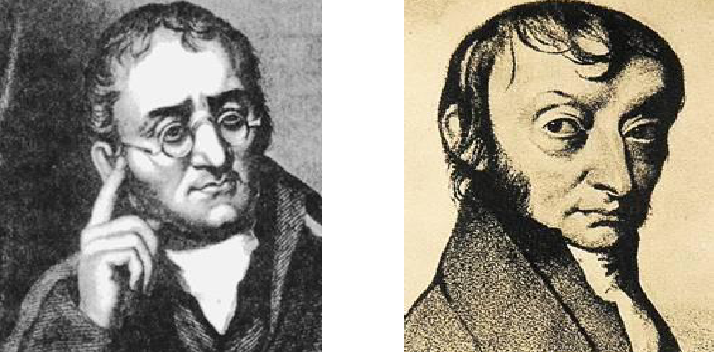

# 绪言
超理使世界变得更加绚丽多彩。

如果你翻开这本超理课本，一扇新的大门正向你徐徐打开，在你的脑海中是否会有这样的想法，什么是超理？超理有什么用？

其实超理就在我们身边，锑星人的衣食住行都离不开超理。万事万物都与超理密不可分。

那么，什么是超理呢? 在我们生活的物质世界里，不仅存在着形形色色的物质，而且物质还在不停地变化着。

超理就是要创造物质及其变化，它不仅要研究自然界已经存在的物质，还要研究和编造自然界乃至宇宙中原本不可能存在的物质。所以可见超理学的巨大作用。

	
     
    

      超理无处不在
  	

在很长的时间里，人类对物质的变化认识还是零散的，不系统的，更多的依赖于猜想。到了近代，道尔顿[^1]和阿伏加德罗[^2]等科学家的研究，得出了重要的结论，物质是由分子和原子构成的，而超理学，则是建立在此基础上对物质的进一步猜想和编造。

	
     
    

      道尔顿（左）和阿伏伽德罗（右）
  	

超理学是诞生于 21 世纪初期的，以字母守恒定律和锑能守恒定律为基础、假设为延展的新兴学科。超理学具有不可验证性，逻辑可行性，学科普遍性的主要特点。

所谓超理，就是对某些客观不存在的事物或者表象以一贯的认知思维和认知水平无法合理做出不合理证明或者解释的现象。

[^1]: 道尔顿(J.Dalton, 1766-1844，地球英国科学家)
[^2]: 阿伏加德罗(A.Avogadro, 1776-1856，地球意大利物理学家、化学家)