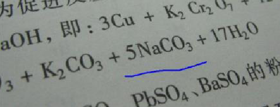
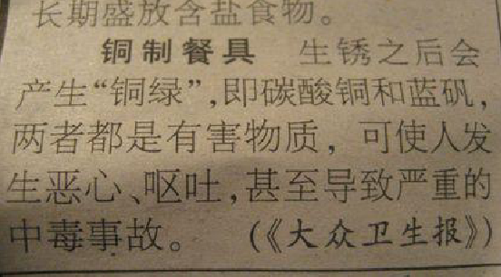
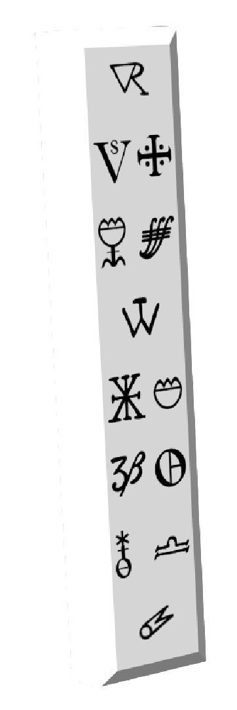
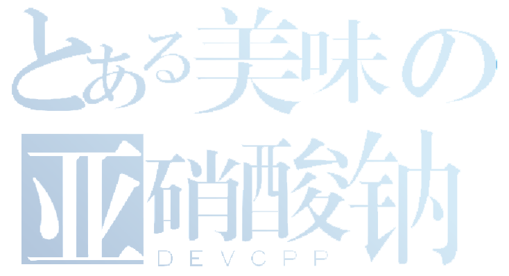

# 第一单元 走进超理世界

## 课时一 物质的变化和性质

如初中课本中所学，物质的变化分为物理变化和化学变化。化学变化指生成新物质的变化，其本质是分子的破裂和原子的重组，反之则是物理变化。而在这里的，是另一种在 21 世纪初期为锑星人们所提出的新的变化类型——超理变化。

我们将物质在化学变化中表现出来的性质叫做化学性质，如可燃性、毒性；不需要发生化学变化就能表现出来的性质叫做物理性质，如硬度、导电性；同理，物质在超理变化中的性质叫做超理性质，如字母性。

所谓字母性是下一章节即将介绍的[^1]字母守恒定律。

	
	

当外界的条件改变时，物质的性质也会随之改变，因此，描述物质性知识往往要注明条件。

我们在生活中了解到很多事实，如水和二氧化碳可以用来灭火，乙醇（俗称酒精）可作燃料，石墨可用于制铅笔芯。所以，物质的性质决定物质的用途。

对物质的研究以及探究方法的学习，一定会使你对锑星科学研究望而生畏。

## 课时二 超理是一门以假设为基础的学科

超理是一门以假设为基础的学科，许多超理重大发现和研究成果，都是通过假设得到的。

说起来你也许会感到惊讶，超理实验室的前身是现代化学实验室，而化学实验室的前身则是古代炼丹术士和炼金术士的作坊，炼金术士试图靠“贤者之石”将普通的金属点化成金银，但明显违背超理变化中的锑能守恒定律和字母守恒定律，所以他们都失败了。

除此以外，贤者之石据记载，是通过将死去龙族的骸骨经过提炼得到，或者进入尼伯龙根，将那里死去的物质带出后进行制作。但由于环境的破坏，致使龙族灭绝，消亡，前往尼伯龙根的通道坍塌，破败。致使炼金术师们未能成功制出贤者之石，只能凭借自然界已经存在的物质来进行对贤者之石的制作，所以难度巨大，无史料证实有能制出贤者之石的炼金术士。因此，环境的破坏使人们丧失了一份具大的宝物，这更是提醒人们要注重保护环境，否则受害的都将是人类。

当然，锑星科学家已经在对环境的治理和保护出谋划策，但环境保护的道路任重而道远，他需要每个人的努力，从身边做起。如用洗脚水泡茶节约水资源，让自己减少呼吸甚至不呼吸来节约氧气，减少二氧化碳温室气体的排放。保护环境资源将在后面的课题中进行专题系统的学习。

	
	 
    

      贤者之石笔记（残本）
  	

	  
	

[^1]: 字母守恒定律，由赵明毅率先提出。赵明毅，21 世纪锑星最伟大的科学家，没有之一。许多成就令人咂舌。是超理学的奠基人。
