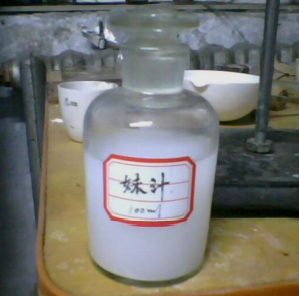

# 附录
## 锑场简介
锑场是一种能够对分子、原子和离子进行操作的力场，由于刚发明出来时用该力场从含锑物中成功将锑分离出来而得名，现仍需要大力研究。锑场的本质不明，可能是磁场、电场、引力场等，其作用点组成的结构是可变的，例如可由点状结构变成网状结构。利用锑场可以分离与合成各种分子和原子，利用锑场能制备几乎所有能够存在的化学物质和各种纳米材料。例如通过锑场制备 $\rm CaCO_3$ 溶液、合成食物、用 $\rm CO_2$ 制取金刚石和臭氧，利用锑场生产氟锂电池的粒子隔板、氮化硼电容式电池、体积约为 $\rm 10\;cm^3$ 每秒能完成 $2\times 10^{30}$ 次浮点运算的激光处理器等。

锑场也是由赵明毅发明的，赵大湿制造的首台锑场发生器主要由超级激光计算机、超高速电子流发生器、J-IM 激光器组成，分离 $\rm SiO_2$ 时效率达 $80\%$，功率达 $\rm 3\;KW$，赵大湿曾自豪地说：“假如给我一个锑场，我能够把‘⿱米共’吃掉！”

## 发功简介
发功采取组场发气，使用统一口令词，用意念调动凝聚虚空中的混元气为我所用。意
念指令是：实验材料真气充足，使得反应向正方向进行。发气人员精神高度集中是条件，关键是意识，这是超理反应取得成果的主要因素。经过锑星科学仪器测试，证明发功时，有电磁波信号，所以，既然生物体能发射电磁波，那么，人在意念高度集中时就可能促使生物体内的物质转化成能量以电磁波的形势辐射出去，作用于其他物质。

## 超理药品品尝报告
1. **超盐酸** 很甜，给人很心旷神怡的感觉，非常美妙。而且有淡淡的酸味儿。最后，感觉整个人都麻酥酥的嗯嗯就像第一次初吻。
2. **臭氟** 没有氟气的呛人，给人的味道，只有温柔的感觉，轻柔，慢的，轻轻的接触嘴唇，虽然不甜，但是怡人的清香，是超盐酸都无法比的。
3. **臭氢** 氢气是无色无味儿，但是臭氢，是金黄色的，一点不臭，是一大股菠萝香味，酸酸甜甜的感觉，就像清纯的学生时代，让人回味无穷。
4. **聚甲炔** 感觉像酒精的味道。可是，像酿过千年的酒，还有茶香味道，让人想起聚甲炔手拉手的感觉。嗯嗯，说不出来肉麻的话，可是心里想法和之后的味道一样，苦涩、甘甜都有。就像同甘共苦的朋友、好兄弟。
5. **臭氰** $\rm (CN)_3$ 初入口，很甜很甜，有微微的醋酸味道，心灵都被麻痹，就像初恋很容易吃醋的感觉。再后，苦和甜都有，就像热恋的人，爱恨交织。最后，又是一种浓烈的甜味，回味甜甜的，就像牵手一生的恋人，回首往事。那种幸福，很难忘。

## 人品的提升和炼金等级的提升
1. 人品的提升。人品的提升要求天时，地利，人和。只有同时满足这三个条件，并饮下集天地灵气，可想不可得，有价无市的天地灵药——**妹汁**，才能有提升。
2. 炼金等级的提升。炼金等级提升别无他法，只有依靠自己孜孜不倦的实验，才能有所成就。平均每成功完成一场初中实验，炼金经验会提升 5 点，完成一场高中实验，会提升 7 点。当炼金等级到达 100 点，就将获得成就——**实验党**，而到达 500 点，就将获得成就——**变态的科学家**。最后，到达 9999 点，就将获得成就——**伟大的恐怖分子**。获得成就伟大的恐怖分子后，发功将会有 $20\%$ 加成！

	
	 
    

      妹汁（$\rm 100\;mL$ 装）
  	

