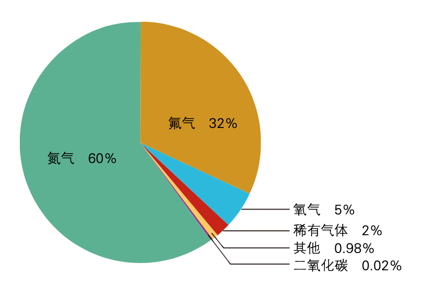

# 第二单元 我们周围的空气

## 课时一 地球的空气和锑星的空气

如初中化学书中所编，两百多年前，拉瓦锡用定量的方法研究了空气的成分。将汞在密闭空间内加热，气体体积减少了约五分之一。

$$
\rm{2\,Hg + O_2 \xlongequal{\triangle} 2\,HgO}
$$

后来，经过人们准确的研究，空气的成分按体积计算，大约是氮气 $78\%$，氧气 $21\%$，稀有气体 $0.94\%$，二氧化碳 $0.3\%$，其他气体和杂质 $0.03\%$。但这并不是实际生活中的空气，不同区域的空气也会有很大不同，因此并未考虑水蒸气等不确定的，可变的气体。除此以外，锑星的空气与地球有很大的差别。如初中教材中所编人体吸入氧气进行缓慢氧化反应维持正常的生理活动，而锑星，则有着氧化性更强的氟气，锑星的生物都只需要少量的氟气就可以满足正常的需求。这也是锑星和地球中空气最大的不同之处。

经大量的，准确的，严谨的，认真的猜想，锑星中空气构成如下：氧气 $5\%$、氮气 $60\%$、氟气 $32\%$、二氧化碳 $0.02\%$、稀有气体 $2\%$、其他气体和杂质 $0.98\%$。其他气体中主要是氮的氧化物，氯气，一氧化碳，以及少量氨气。以上准确结论其实是在近段时间才被人们发现，在此之前，人们一直误认为锑星中的氟气是氧气，直到锑星一名科学家在空气中点燃氢气，并用他认为的“纯净水”洗脸，用于生活，后来与世长辞之后，后面的科学家才继续对锑星空气组成进行更严谨的实验，才发现了空气中的氟气（$\rm {F_2}$）。

	
	 
    

      锑星的空气构成
  	

众所周知，空气是一种宝贵的资源，氧气氮气的作用不言而喻，初中教材中都有详尽的介绍，并且考试都有考到。本教材主要介绍的是稀有气体。

在空气的成分中，稀有气体（氦、氖、氩、氪、氙、氡 6 种，读音分别是 hài nǎi yà kè xiān dōng）。他们无论是在地球还是在锑星，所占的比例额都很小。他们都没有颜色、气味，化学性质很不活泼。甚至在以前，人们因为不能使它们反应，曾把它们叫做惰性气体。

其实，这种观点是错误的。他们只是不活泼，不去拈花惹草，和别人抢电子罢了，他们自给自足，为自己抱定的志向感到快乐（好耳熟的感觉），不与世俗同流合污。后来，地球的人们陆续发现了他们的化合物，打破了稀有气体不能参与化学反应的观点，使化学发生得以进步。但是制出的化合物种类比较有限。此时，锑星科学家参与了研究，通过锑星的强酸，发现了大量的稀有气体化合物。锑星的超强酸在之后会有介绍。

至此，所有元素都被人们发现了它们相应化合物的存在。成为超理学一个里程碑的存在。

当然，这里只介绍稀有气体并不是代表氧气，氮气不重要，相反，他们占有重要的地位。如锑星养生学家苏十博士[^1]发明了液氧沐浴法，原理是通过液氧进行沐浴，来进行避暑，还可以增强人的抵抗力，而且因为氧气充足，人的大脑也会得到放松。

## 课时二 氧气及氧气的制取（酸碱互化原理）

在上一课时中，介绍了锑星科学家苏十发明的液氧沐浴术，除此之外，氧气还有很多重要作用，如在地球，氧气是人们呼吸作用的原料。供给人们的缓慢氧化反应。因此，它有助燃性，可以供给呼吸，也可以帮助燃烧。这些在化学教材中都有详细介绍。

$$
\rm{S + O_2 \xlongequal{点燃} SO_2}
$$
$$
\rm{SO_2 + H_2O = H_2SO_3}
$$
$$
\mathrm{2\,H_2SO_3 + O_2 = 2\,H_2SO_4}
$$

这是酸雨的一个很重要的来源。对此，锑星科学家对硫酸的治理展开研究，并且在研究中发现了新理论——酸碱互化原理。

所谓酸碱互化就是将酸性物质转化为碱性物质，也可以转换部分，再由被转化的物质与原有物质发生反应，使得 pH 值最后变为中性。如

$$
\rm H_2SO_4 \xlongequal{发功} SO_2(OH)_2
$$

如上，这种反应条件特别的，就是超理反应。那么在此，就引出超理反应的定义：**超理反应就是反应条件为“发功”“ZMY”或者“锑”“锑场”为催化剂或起催化作用的反应**。

酸碱互化原理，则是通过一定条件，将酸性物质转化为碱性物质，那么，酸碱互化原理的定义：**酸碱互化原理就是物质可以通过超理反应，再不改变物质分子构成的条件下，改变物质 pH 值，并且反应前后 pH 值一个大于 7，另一个小于 7 的反应。根据酸碱互化原理发生的反应叫做酸碱互化反应**。

这一反应由锑星科学家倍海滋宏-德海滋[^2]发现的。

据传，倍海滋宏-德海滋刚开始从事环境保护时对环境保护一窍不通，更对酸雨的防治束手无策。不过，在一次无聊时，倍海滋宏-德海滋将 pH 试纸放入雨中，竟然发现雨水呈碱性！好奇的倍海滋宏-德海滋便像考试中好奇的小明一样开始对此展开研究。可是，无论如何，他也没能找到新的物质。直到一天他做梦，梦见了一位帅气的老师在讲化学。仔细一看，老师英俊潇洒，风流倜傥，高大威猛。向前询问，那人说：“我是武大帅！赵明毅的老师！”梦醒后，便顿悟了酸碱互化原理。顺便一提，倍海滋宏-德海滋再后来回忆那位梦中的老师时，只用了精炼的四个字：**又黑又帅**！

酸碱互化原理也为后来赵明毅的锑能守恒定律做好了铺垫。

### 大分解反应

当然，氧气的用途不仅仅是供给呼吸，还可以有其他更多的用途。就不在此列举。

根据地球教材，实验室制造 $\rm O_2$ 主要方法是过氧化氢（$\rm H_2O_2$）分解，高锰酸钾（$\rm KMnO_4$）分解还有氯酸钾（$\rm KClO_3$）分解。但实际上，氯酸钾分解制氧气是一种很不方便的方法，甚至还有一定的危险性。在这里不作说明。所以，在这里附上高锰酸钾之歌，文不长，录如下：

>  主族副族金属，升高化合价，碱金属和碱土金属被氧化。成千上万酸碱，汇成一句话——高锰酸钾，高锰酸钾，高锰酸钾。高锰酸钾，制取氧气的办法；高锰酸钾，管口微微向下;高锰酸钾，加热要塞棉花。高锰酸钾高锰酸钾高锰酸钾，高锰酸钾!
> 
（歌唱时可配上徐沛东先生所作《爱我中华》之曲调）

$$
\rm 2\,H_2O_2 \xlongequal{催化剂} 2\,H_2O + O_2\uparrow
$$
$$
\rm 2\,KMnO_4 \xlongequal{\triangle} K_2MnO_4 + MnO_2 + O_2\uparrow
$$

以上是地球实验室制取氧气的办法，不是很先进，锑星有着更简单，简便的方式。如对大理石发功。众所周知，大理石是一种很常见的矿石，被广泛用于建筑，道路。而锑星正是通过大理石很常见来制取氧气。

$$
\rm 2\,CaCO_3 \xlongequal{发功} 2\,Ca + 2\,C + 3\,O_2\uparrow
$$

这种超理反应后，参加反应的化合物分解为组成元素单质的反应，叫大分解反应，是超理的一种基本反应类型。注意的是，大分解反应是建立在超理反应中，如水通电分解，就不属于大分解反应。对于超理反应的反应类型，后面将会有专门的课时进行系统的学习。

[^1]: 苏十，锑星著名科学家，养生学家。主要贡献有液氧沐浴，液氨沐浴改进。开启了锑星保健时代，是锑星将科学与保健结合的始祖。
[^2]: 倍海滋宏-德海滋，锑星著名科学家，环境学家。发现酸碱互化理论。