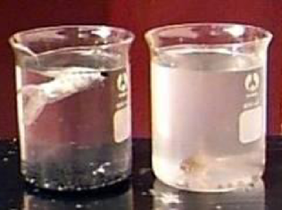
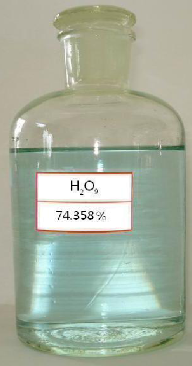

# 第三单元 氢

## 课时一 脱碳甲醛与水

脱碳甲醛顾名思义将甲醛通过一定方法得到的。我们的目的就是使其中的碳元素被脱离开来。为了解决这个问题，锑星科学家们进行了研究，最后锑星科学家倍海滋宏-德海滋成功找到了将甲醛脱去碳元素的方法。将甲醛和氢气置于密闭空间。方程式如下：

$$
\rm HCHO + H_2 \xlongequal{\text{发功}} HHO + CH_2
$$

不过，反应必须在密闭条件中进行，否则氢气会和空气中的氧气，氟气等物质结合。原理就是用氢气，抢夺出甲醛中的碳元素。当然，反应完毕后要对气体进行加压，使其变为液体，再点燃，除去卡宾及卡宾不稳定生成的新物质。之后，这就是脱碳甲醛溶液。虽然化学式与水无异，但根据锑星科学家倍海滋宏-德海滋的研究，他们并不是同种物质。倍海滋宏-德海滋做过一个有趣的实验，他把普通的水在山上煮沸，发现普通的水 90 多度就沸腾了，而脱碳甲醛在吐鲁番盆地中的山上还是 100 度沸腾，甚至更高，这足以说明他们不是一种物质。

那脱碳甲醛和水到底有哪些不同之处呢?这就是接下来我们要研究的问题。

众所周知，水是人类生活必需的物质。是地球上生物离不开的物质。而脱碳甲醛有什么特别的性质呢?

脱碳甲醛的性质：常温下无色无味的液体，不具有吸水性，与水任意比互溶，水溶液中性(不含杂质的情况下)密度为 $1$ 克/立方厘米，相对分子质量为 $18.01528$。在一个大气压下沸点为 $\rm 100\;{^\circ}C$，凝固点为 $\rm 0\;{^\circ}C$。比热 $\rm 4.186\;J/(g⋅{^\circ}C)$（$\rm 0.1\;MPa, 15\;{^\circ}C$）。最大相对密度时的温度 $\rm 3.98\;{^\circ}C$。可溶于酒精，可溶解多种物质。

脱碳甲醛的毒害性：被人大量吸入肺部可导致人因呼吸系统衰竭而死亡。现已在大多数肿瘤患者的肿瘤细胞内发现该物质。

长期饮用硬度过大的脱碳甲醛可导致肾结石与膀胱结石。而且，根据调查脱碳甲醛还是酸雨的主要成分。

	
	 
    

      脱碳甲醛（左）与水（右）
  	

### 危害
1. 是酸雨的主要成分；
2. 对泥土流失有促进作用；
3. 对温室效应有推动作用；
4. 它是腐蚀的成因；
5. 过多的摄取可能导致各种不适；
6. 皮肤与其固体形式长时间的接触会导致严重的组织损伤；
7. 发生事故时吸入也有可能致命；
8. 处在气体状态时，它能引起严重灼伤；
9. 在不可救治的癌症病人肿瘤中已经发现该物质；
10. 对此物质上瘾的人离开它 168 小时便会死亡；
11. 过量摄入此物质会引起脱碳甲醛中毒，该病极难治疗，通常服用醋酸铀酰锌钠和二氧化钋的混合溶液来治疗。

以上资料足以证明脱碳甲醛的危害性。所以，作为一名新世纪的学生，我们应勇敢的向脱碳甲醛说 No！

## 课时二 氢的氧化物[^1]——九氧化二氢与五氧化二氢

九氧化二氢（$\rm H_2O_2O_7$）又称为焦氧酸，是氢的一种特殊氧化物。将液氧以 $1:1$ 比例溶解于五氧化二氢（氧酸，$\rm H_2OO_4$）后可以制得。九氧化二氢具有令超理学家们咋舌的结构，在九氧化二氢中，两个竟然可以呈现出 $+6$ 的高价态氧原子，其余的氧原子则呈现 $-2$ 价态。纯的九氧化二氢是淡蓝色透明的晶体，$\rm 250\;{^\circ}C$ 时分解为水和氧气:

$$
\rm 2\,H_2O_2O_7 \xlongequal[250\;{^\circ}C]{\text{发功}} 2\,H_2O + 8\,O_2\uparrow
$$

九氧化二氢是一种强酸，与人体接触可以腐蚀人体的皮肤，这主要是因为其剧烈的吸水性（会发生脱水作用）；九氧化二氢极易溶于水，常温下 $\rm 100g$ 水能够溶解 $\rm 290g$ 九氧化二氢；暴露在含水分多的空气中会剧烈潮解。因此一般不常使用纯的九氧化二氢而用其溶液。接近饱和的九氧化二氢溶液为浅蓝色黏稠的油状液体，腐蚀性极强。

	
	 
    

      九氧化二氢
  	

九氧化二氢（又称焦氧酸）是一种吸水性和氧化性极强的酸，也是一种极具前途的超理试剂。但制取九氧化二氢所需的氧酸（五氧化二氢）是一种较难得到的酸，其制备需要使用深蓝色透明的晶体三氧化氧（注：不要与真实存在的四聚氧混淆，四聚氧为氧分子的二聚体，氧元素的化合价为 $0$；三氧化氧中三个氧原子的氧化态为 $-2$，一个氧原子氧化态为 $+6$），而三氧化氧的制备需要以锑（$\rm Sb$）作催化剂。锑元素原子序数 51。现时锑星每年的三氧化氧产量约为 $\rm 3\;t$，因此造成了五氧化二氢的稀缺。但根据明毅第三锑场定律，三氧化氧可以将臭氧与氧气以 $2:1$ 比例混合，在强锑场下产生。

根据明毅第三锑场定律，当锑场强度达到 $\rm 2.5 \times 10^6\;zmy$ 时，两种物质可以迅速化合生成三氧化氧。其中氧分子中氧原子的原子核会被强锑场部分分离，似聚非聚、似合非合，使得它可以呈现出 $+6$ 的氧化态。反应方程式为:

$$
\rm O_2 + 2\,O_3 \xlongequal{\text{发功}} 2\,OO_3
$$

于是，就可以通过三氧化氧制得氧酸，最终得到九氧化二氢。至于这中间的变化，本阶段暂时不要求掌握。

## 课时三 氢的无氧酸

通常氢气不是电解质，也难溶于水，但最新发现表明，在含有超盐酸高鉲（四十氯化五鉲，$\rm Ka_5(Cl_{10})_4$）的水溶液中，由于超盐酸根的魔键作用以及高价鉲的自催化氧化性，氢气可以发生电离。

$$
\rm H_2 \rightleftharpoons H^+ + H^-
$$

$$
\rm H_2 \rightleftharpoons 2\,H^+ + 2\,e^-
$$

由于 $\rm Ka^{8+}$ 和魔键的相互作用加上其本身的自催化效应，魔键会把 $\rm Ka$ 离子和氢负离子或电子控制在它们附近（事实上这两种粒子同时有被超盐酸氢根还原和被 $\rm Ka^{8+}$ 氧化的趋势），$\rm H^+$ 得以游离，形成了氢氢酸溶液（又名氢酸，氢氢酸是学名）。

$\rm Ka_5(Cl_{10})_4$ 只起稳定其酸根的作用而不参加反应，所以可以看成它的酸根只是 $\rm H^-$ 和 $\rm e^-$。

在这种溶液中，$\rm H_2$ 几乎可以完全电离。

氢氢酸根毫无疑问具有极强还原性，但是由于 $\rm Ka_5(Cl_{10})_4$ 的限制作用，和它反应的氧化剂必须高于 $\rm Ka^{8+}$ 的自催化氧化还原电势（$\rm 1.051\;v$）。

$$
\rm 2\,MnO_4^- + 16\,H^+ + 10\,H^- = 2\,Mn^{2+} + 8\,H_2O + 5\,H_2
$$
$$
\rm 2\,MnO_4^- + 8\,H^+ + 2\,e^- = 2\,Mn^{2+} + 4\,H_2O
$$

*（此处及以下全文反应条件均为 $\rm Ka_5(Cl_{10})_4$）*

在第一式中，生成的 $\rm H_2$ 又会部分溶于溶液。

氢氢酸与金属反应时，
$$
\rm Mg + 2\,HH = MgH_2 + H_2
$$

第一个反应确实是可以发生的，但是生成的 $\rm H_2$ 也会溶解。所以，氢氢酸和金属反应不生成氢气。

氢氢酸及其盐可发生复分解反应。

-   酸式盐

$$
\rm MgH_2 + 2\,NaOH = Mg(OH)_2 + 2\,NaH
$$

-   正盐

$$
\rm 2\,Na + HH = 2\,NaH
$$

$$
\rm 2\,Na + 2\,H_2O = 2\,NaOH + H_2\uparrow
$$

<i>（$\rm Ka_5(Cl_{10})_4$ 并不能改变这个反应）</i>

另外要注意的是
$$
\rm 2\,Na + 2\,HCl = 2\,NaCl + H_2
$$

这个反应在无 $\rm Ka_5(Cl_{10})_4$ 时，可看做是 ***盐 + 强酸 = 盐 + 弱酸***。

在有 $\rm Ka_5(Cl_{10})_4$ 时，生成的 $\rm H_2$ 形成了氢氢酸，

$$
\rm 2\,Na + 2\,HCl = 2\,NaCl + HH
$$
$$
\rm 2\,Na + HH = 2\,NaH
$$

总的反应为:

$$
\rm 2\,Na + HCl = NaCl + NaH
$$

（值得注意的是，本课时以上反应中，均有含有锑能的物质参与反应，所以以上反应，虽然没有批注超理反应的反应条件，但都属于超理反应范畴。）

## 课时四 超理反应类型

超理学是一门建立在字母守恒定律的基础上的一门学科。自然而然，超理反应也有自己的反应类型。在之前的锑星制取氧气的学习，我们了解到锑星里可以对大理石等含氧物质进行发功，发生大分解反应，那除了大分解以外，还有什么基本反应类型呢？

以下均不要求掌握。

根据字母守恒定律，人们发现了:

### 1. 裂解反应：$\rm Ab \xlongequal{\text{发功}} A + B$
如用来制氧气：$\rm 2\,Co \xlongequal{\text{发功}} 2\,C + O_2\uparrow$

提取单质碘：$\rm 2\,Ni \xlongequal{\text{发功}} I_2 + N_2\uparrow$

### 2. 合成反应：$\rm A + B \xlongequal{\text{发功}} Ab$
用来制造放射性元素：$\rm 2\,C + F_2 \xlongequal{\text{发功}} 2Cf$

### 3. 交换反应：$\rm Ab + C \xlongequal{\text{发功}} Ac + B$
作用很大，比如赵明毅大师的炼金法之一：
$$
\rm As + U \xlongequal{\text{发功}} Au + S
$$
$$
\rm Ac + U \xlongequal{\text{发功}} Au + C
$$

### 4. 双裂解反应：$\rm Ab + Cd \xlongequal{\text{发功}} Ad + Bc$
*（以上表达式中字母均为字母）*

以上是本阶段了解的反应类型。还有一些未加列出。以上四条是根据字母守恒定律得出的结论，但是还可以根据锑能守恒，建立新的基本反应类型:

### 5. 大分解反应：$\rm AB \xlongequal{\text{发功}} A + B$
生成反应物组成元素单质的超理反应叫大分解反应。

### 6. 大化合反应：$\rm A + B \xlongequal{\text{发功}} AB$
两种或两种以上单质生成一种物质的反应叫大化合反应。

### 7. 大置换反应：$\rm AB + C \xlongequal{\text{发功}} AC + B$
易得，是超理反应中的置换反应。

### 8. 大复分解反应：$\rm AB + CD \xlongequal{\text{发功}} AD + BC$
同上。

*（以上表达式中字母均为元素符号）*

[^1]: 这里的氧化物是指地球上广义的氧化物，即有两种元素组成，且氧为负价的纯净物。
