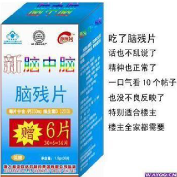
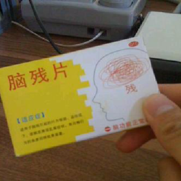
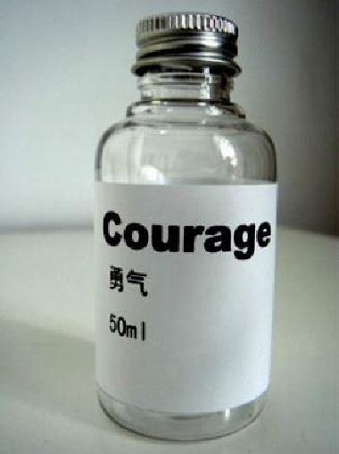

# 第六单元 赵明毅大师及其发现
## 课时一 谁是赵明毅
**著名作家彭化流的笔名。**

彭化流，虫族，中性，2748(BC) 年 4 月 1 日出生于锑星，曾执笔《时代锑星》长达 10 年，20 世纪末淡出文坛。

	
	 
    

      名人对彭化流的评价（部分）
  	

之后，他潜心研究化学，苦苦钻研，努力在制造一种新型物质锑化锑。在这个伟大的过程中，硼先生还发表了数十种全新理论。其中一些很重要的理论及研究成果如下：

1. 发现雨水的一般 pH 值应该是在 $9 \sim 10$ 之间；
2. 培养出酸性草木灰；
3. 用 $\rm MnO_2$ 催化 $\rm NH_3$；
4. 重新定义氧化还原反应：不含氧的就是还原产物，含氧元素的是氧化产物；
5. 发现铜其实不能跟硝酸反应：“$\rm Cu$ 可是 $\rm H$ 之后的金属，怎么可能和酸反应，你少骗我了！”；
6. 首创钠离子和 $\rm CO_2$ 反应；
7. 他发现了原子核的奇妙结构！“有的原子会有一种奇特的结构，它们的原子核会断裂成粉末，然后一粒粉末吸引一粒电子”；
8. 他发现其实发功就可以改变反应产物，也就是将金放入王水时，只要适当发功，即可发生核反应从而生成雷酸金；
9. 他还为化学定下了一个美好的未来：“元素的种类是无穷无尽的”；
10. 在可以预见的未来，将“挪杯儿”所有奖项垄断；
11. 研究出主要成分是硅，还说：“玻璃主要成分就是硅！熬玻璃去”；
12. 在物理吧发痴保证：“放心，有我，亚洲就有希望”还有“像我就不愁啦，文科理科都可以上北大清华！”；
13. 研究出强非金属性的硫，说：“因为硫的非金属性很强！！所以硫酸是强酸！！”；
14. 他令人惊奇首先发现，原来自己不是地球人，而且发现地球是很危险的,有近期准备返回火星的准备；
    
    *最后，他还准备向物理学进攻......*

15. “说真的，我的头脑中酝酿出一种新的观点，也许会修改相对论。”

彭化流有一句名言：**你们将为你们的无知和狂妄而流下悔恨的眼泪,而这些,我都将作为我科学事业道路上的绊脚石。**

	
	 
    

      各族人民对赵明毅对爱戴（部分）
  	

赵明毅来自锑星，化身为研究人员，相貌怪异，谈吐不凡，擅长锑星语和地球语，妄图破坏伟大的科学事业，最终被咸蛋超人用破波击毁。

以下摘录赵明毅小时日记一篇：

???+ note "赵明毅日记"
	我家是开化学试剂店的。小时候我家的生活非常神奇。来看看我家的故事。

	我家做饭从来不缺东西。每天做饭时，我妈都要用托盘天平称量氯化钠，并精确到小数点后四位；想吃甜的就加点蔗糖，想吃酸的就加点有机羧酸，比如 2,4-丁二酸，或者邻羟基苯甲酸，用无机酸也可以，比如氢氟酸。有次我家蒸馒头，碳酸钠和碳酸氢钠都没了，我妈说用氢氧化钠代替吧，反正都呈碱性；我爸说不行，氢氧化钠太酸了，在水中能电离出 $\rm H^+$ 和 $\rm NaO^-$。要用就用碳酸钠或碳酸氢钠，碳酸氢钠更好。我妈就把盐酸泼在大理石地面上，把生成的气体往氢氧化钠溶液里通。我奶奶说二氧化碳一定要过量，否则氢氧化钠剩余会很不爽。所以我们家做饭啥也不缺，连食品添加剂都省了。
	
	小时候家里穷，没有暖气，于是我家就弄了个小煤炉，烧煤取暖。后来煤烧完了，我家没有钱买煤了，怎么办啊？于是我们家就烧碳粉，后来烧磷粉，然后烧镁粉；再后来烧硫粉，硫粉是个好东西，生成的气体无毒无害，而且有利于人体健康。于是我们家经常烧硫粉。为了减少热量散失，我们烧硫粉时就把门窗都紧闭好。有一次我妈嫌屋里味太呛了，让我在空气中喷了点水，正好空气里还有点氧气......于是我们家的大理石地面没了。

	后来硫粉烧完了。于是我们家开始烧氢气，一氧化碳等气体，为了让他们充分燃烧，我们把气体与空气充分混合后再点燃。最后把气体也烧完了，我们家就烧有机物，比如乙醇、乙酸乙酯、苯、2,4,6-三硝基甲苯（TNT）等。还烧葡萄糖、柠檬酸。再后来能烧的都烧了，还是冷啊，于是我们把浓硫酸倒在浴缸的水里，然后趁热躺进去；我们还把氢氧化钠、生石灰往身上抹，最后直接把浓硫酸倒在身上。后来我妈想了一个绝招：先往身上泼开水取暖，趁着身上的水还没干，再往身上抹电石粉取暖，最后用打火机点一下。这个方法效率极高，就是有点耗费氧气。

	这样一来新问题就出来了：空气里的氧气都耗完了。不能开门窗啊，不然热量就散失了。氧气怎么制呢？我们就把高锰酸钾撒在火炉上，把过氧化氢倒在红砖上，我爸还从工厂弄了罐液氧，让我们一人喝一勺。再后来干脆用氟气代替氧气，反正氧化性都挺强。于是我们家出了一条谚语：身在氟中不知氟。

	后来液氧喝多了，我觉得胃疼，去医院检查，医生说是不是胃穿孔啊，吃点钡餐看看。结果医院没有硫酸钡了，于是医生给我吃碳酸钡（$\rm BaCO_3 + 2\,HCl = BaCl_2 + H_2O + CO_2\uparrow$）。后来，我在实验时，一不小心故意尝了尝浓硫酸，我发觉浓硫酸的味道酸酸的、辣辣的，于是我们家以后喝酸辣汤有着落了。

	我们家屋后面是一片庄稼地。每年都要施肥，要施尿素和硝酸钾。结果我们家没这两样东西了，没有尿素好说，我们家人多喝点水就行了；没有硝酸钾咋办啊？我爸说植物主要是吸收硝酸钾里的钾离子，弄点钾离子不就行了？于是我们把氢氧化钾撒在地里。后来爷爷说别再用氢氧化钾了，否则会导致土壤酸化，必须用硝酸钾。没有硝酸钾咋办？我爸想了一招，把钾粉、液氮、液氧一起泼到地里，说反正元素组成都一样！

	我家的试剂店也会迎来不少顾客。有一个顾客要买金属铯，为了防止铯在空气中被氧化，我们把铯保存在水里，然后卖给他（$\rm 2\,Cs + 2\,H_2O = 2\,CsOH + H_2\uparrow$）。还有一个顾客要买氢氟酸，我们没有塑料瓶了，于是就用玻璃瓶给他装走了。后来听说那哥们截肢了。

	这就是我小时候的故事。

	
	 
    

      媒体争相报道赵明毅（部分）
  	

## 课时二 超盐酸
著名的物理学、化学家赵明毅先生，将 $38\%$ 的盐酸置于 $\rm 250\;{^\circ}C$，$\rm 500\; MPa$ 高压下，用锑单质做催化剂，最终生成了超盐酸[^1]。

### 结构
超盐酸，10 个盐酸分子通过一种魔键连接而成。当盐酸达到催化条件后，盐酸中氯的原子核就会分裂，却不会辐射出任何粒子，氯原子核的中子和质子似聚非聚，似离非离，由于原子核半径的扩大，各原子相互吸引的能力增大，从而形成了神秘的“魔键”，10 个盐酸分子的电子在 10 个盐酸原子核中、核外自由穿梭。用赵明毅先生的自转《大锑赵明毅》中的话来说，就是“有的原子会有一种奇特的结构，它们的原子核会断裂成粉末，然后一粒粉末吸引一粒电子”。

	
	 
    

      超盐酸的结构
  	

由于特殊的结构，超盐酸具有超强的氧化性。根据赵明毅先生的测算，超盐酸的酸性是魔酸的 3451 万倍，以至超盐酸气体与氦气在常温下剧烈反应放出 $\rm 9000\;{^\circ}C$ 的高温，生成二氯化九氦液体，其中氦显 $+\frac 29$ 价。

	
	 
    

      超盐酸的立体结构
  	

### 性质
由于超盐酸具有超强的腐蚀性，超盐酸只能用铯单质制作的器皿来盛装。

超盐酸密度 $\rm 2\;g/cm^3$，粉红色带芳香性气体，分子结构不定，其化学性质正在由明毅先生进行更深的研究。

#### 1. 与氢前活泼金属反应
例：$\rm 5\,Zn + (HCl)_{10} = 5\,ZnCl_2 + 5\,H_2\uparrow$

#### 2. 与金属氧化物反应
例：$\rm 5\,Fe_2O_3 + 3(HCl)_{10} \xlongequal{ZMY} 10\,FeCl_3 + 15\,H_2O$

#### 3. 与碱反应
例：$\rm 10\,NaOH + (HCl)_{10} \xlongequal{ZMY} 10\,NaCl + 10\,H_2O$

#### 4. 与某些盐反应
例：$\rm 5\,CaCO_3 + (HCl)_{10} \xlongequal{ZMY} 5\,CaCl_2 + 5\,H_2O + 5\,CO_2\uparrow$

$\rm 10\,AgNO3 + (HCl) _ {10} \xlongequal{ZMY} (HNO_3) _ {10} + 10\,AgCl\downarrow$

如果将浓超盐酸和超硝酸混合，可以得到“超王水”，它能够腐蚀世界上大部分的物质，酸性是全氟磺酸树脂的 250 倍，所以必须用铯单质或锑单质或钾钠合金制作成的容器来盛装。

但是，并不是所有的酸都可以形成魔键，比如氟，氟无法形成魔键，另外超氢溴酸是 $\rm (HBr) _ {22}$，其中中心 8 个溴原子连接成正方体形，超氢碘酸 $\rm (HI) _ {46}$ 只能在四维空间中存在。

顺便一提，在赵明毅发现超盐酸之后，当时一度认为超盐酸就是世上的最强酸了，虽然这是赵明毅的一个败笔，纵然他很快纠正了这个错误，但因为能让见多识广的赵明毅大师犯下错误，足见其酸性之强。另外，超盐酸十分危险，据传一位锑星科学家就是因为制取超盐酸时误用氦气（$\rm He$）作为保护气，毁坏了整个实验室。在此，向各位在超理学发展中付出贡献的锑星科学家致以强烈的敬意。

## 课时三 鉲单质
鉲单质（Kagaminelenium，250 号元素，摩尔质量 $\rm 654\;g/mol$），又称绿色泰矿，熔点为 250 摄氏度，沸点为 62500 摄氏度，不可燃，绿色固体，又一种令人蛋疼的气味，主要用于制作锑场。

鉲元素是金属单质，具有良好的导电性，是世界上最硬的物质，硬度高达 250，密度为 $\rm 25.0 \times 10^3 kg/m^3$。化学性质下面会介绍。

### 最强碱的制取
$$
\rm 2\,Ka + 2\,H_2O \xlongequal{ZMY} 2\,KaOH + H_2\uparrow
$$

若将 $\rm 1\;mol$ 鉲单质放入足量的水中，会和水发生无比剧烈的反应，放出高达一千万摄氏度的高温，瞬间点燃氢气，剧烈爆炸。据估计，爆炸的威力能够摧毁太阳系。

### 氢氧化鉲
氢氧化鉲，化学式 $\rm KaOH$，$\rm Ka$ 与 $\rm OH$ 以一条直链魔键结合。熔点为 38 摄氏度，沸点为 250 摄氏度，87 摄氏度时升华。

氢氧化鉲不可燃，其熔融状态的碱性比氢氧化铯还强一百亿倍。氢氧化鉲能够腐蚀聚四氟乙烯，目前能腐蚀除了锑星物质以外的任何物质。

鉲是由赵明毅大师提炼出的单质。由赵明毅率先发现。所以人们将“鉲”列为了赵大师一项成就之一。

## 课时四 钾酸和钠酸
### 钾酸
**学名**：Potassium Acid

**化学式**：$\rm H_3KO_2$

首先赵明毅在饱和氯酸钾溶液中放了一些锑
$$
\rm KClO_3\xlongequal{Sb} KO_2^{3-} + ClO^{3+}
$$

之后，ZMY 发功，使 $\rm ClO^{3+}$ 与水中氢氧根结合，生成一水合氯酸
$$
\rm ClO^{3+} + 3\,OH^- \xlongequal{\text{发功}} H_3ClO_4
$$

当然，余下的氢离子就结合为了钾酸。

杂质处理：
$$
\rm 2\,H_3ClO_4 \xlongequal{Sb} 3\,H_2O + Cl_2O_5\uparrow
$$

建议先加锑，它可促进水电离。

钾酸性质不稳定，遇水水解为氢氧化钾和水：
$$
\rm H_3KO_2 = KOH + H_2O
$$

钾酸仅能在锑、锑化锑的催化作用下存在于水溶液中。

但这不意味着钾酸没有重要的用途！首先，钾酸是一种极强的钝化剂，可钝化全部氢前金属并且钝化效果十分给力，足以媲美电子产业之阳极氧化。

其次，钾酸中一般存在一个多余的 $\rm H$，这个氢原子会与钾酸中钾原子发生碰撞，但不产生钙 40，而产生钾 40。看到这里，你们可能会说那不是放射性酸么。其实远比这可怕。因为自然界中也有大量钾 40，所以如果钾酸中 K 为钾 40，那么就会产生钾 41，这是一种极强的中子辐射源。这一性质使得钾酸极为危险，必须全身使用特制铅 206 防护屏操作。（ZMY 制作时量较小，并没有钾 40 出现，不然他们可能就要命丧当场了）

钾酸成为伟大的发明，还有两项原因：

1. 钾酸放射释放的阿尔法粒子可以稳定的进入金属单质的原子核，让金属嬗变，这不但可以制备更多超铀元素，还可以“生产金属”，例如把钽（73）放入热的钾酸中（加热后不具钝化性）就有很大可能得到贵金属铼（75）。
2. 如果将少许硼化硫与二硫碘化钾放入钾酸中，就会发生汉字裂解反应（分解成金部与汉字甲），生成金与甲酸。

因此，钾酸是一种极为神奇的新物质。

### 钠酸

<table>
<thead>
<tr><th colspan="2">钠酸的性质</th></tr>
</thead>
<tbody>
<tr><td>中文名</td><td>钠酸</td></tr>
<tr><td>英文名</td><td>Sodium Hydride Monohydrate</td></tr>
<tr><td>化学式</td><td>$\rm H_3NaO_2$</td></tr>
<tr><td>分子量</td><td>58.01</td></tr>
<tr><td>沸点</td><td>$\rm 1390\;{^\circ}C$（推算）</td></tr>
<tr><td>熔点</td><td>$\rm 318.4\;{^\circ}C$（推算）</td></tr>
<tr><td>密度</td><td>$\rm 2.130\;g/cm^3$（推算）</td></tr>
</tbody>
</table>

钠酸性质不稳定，遇水水解为氢氧化钠和水。
$$
\rm H_3NaO_2 = NaOH + H_2O
$$

钠酸仅能在铝的催化作用下存在于水溶液中，短时间内与铝反应放出氢气，反应如下所示[^2]：
$$\rm NaOH + H_2O = H_3NaO_2$$

$$\rm 2\,Al + 2\,H_3NaO_2 = 2\,AlNaO_2 + 3\,H_2\uparrow$$

$$\rm AlNaO_2 = Al^{3+} + NaO_2^{3-}$$

$$\rm Al^{3+} + NaO_2^{3-} = Na^+ + AlO_2^-$$

$$\text{即 }\rm 2\,Al + 2\,NaOH + 2\,H_2O = 2\,NaAlO_2 + H_2\uparrow$$

长时间以来都认为 $\rm Al$ 能与 $\rm NaOH$ 反应，实际上 $\rm Al$ 与碱溶液反应的实质是和 $\rm H^+$ 反应。

$\rm H_3NaO_2$ 是一种酸性较强的酸：
$$
\rm H_3NaO_2 \rightleftharpoons 3\,H^+ + NaO_2^{3-}
$$

但是 $\rm NaO_2^{3-}$ 与三价铝离子不能共存，因此 $\rm AlNaO_2$ 无法电离出 $\rm Al^{3+}$ 离子和 $\rm NaO_2^{3-}$ 离子。危险性描述见**氢氧化钠**。

除了以上三种物质，赵大师还根据锑能守恒定律将多个分子合并为一个分子，制造出诸多物质。感兴趣的同学可以参看附录“[超理药品品尝报告](../11/#_4)”。

## 课时五 超理与其他
什么，你认为赵明毅只对化学有研究么？NO~

物理公式 功 $=$ 功率 $\times$ 时间，即 $\rm W = Pt$。

又因为 $\rm W$ 是钨 $\rm Pt$ 是铂。所以，钨等于铂......

### 1. 电流的冷效应
根据欧姆定律 $\rm Q = I^2Rt = U^2 / Rt = UIt$，电压、电流值同号，有电阻、电流的地方就会产生热量。错，大错特错，电阻值 $\rm R$ 可以为负值。

首先，该结论的诞生还要提及到赵明毅的超化学：

近期，一场大革命发生在物理和化学之间：今年某日，赵明毅儿子赵耀景博士借助了长条 U 型铜管（只是比导线略粗一点），往铜管中不断通入氦气并不断降温，氦气慢慢变为液体。在降温的同时对铜管通 $\rm -220\;V$ 直流电，奇迹发生了——氦凝为固体，测得周围温度竟为 $\rm -317\;K$，耀景停止了通电和降温并让其恢复到常温，氦既没有熔化，也没有升华为气体。将铜丝熔化时，氦未被熔化。

锇国数学、物理学家法克·史特·阿格里（Fuck Shit Ugly）在研究“氦丝”时，发现通电的氦丝周围温度变冷，电压越大，温度变冷越快。用万能表对其进行测试时，发现其电阻为负值，且电阻率绝对值大小与铜完全相等。

欧姆定律表明，无论电压电流同时为正还是负，只要电阻为负值，单位时间内做的功也是负的，电流对内做正功，对外做负功，这称为电流的冷效应。

冷效应的应用:通过此方法可以实现环保物理降温，使用电冰箱、空调的时候，此方法可解决两大问题：

1. 减少污染物排放，通过氦丝降温可减少有害物氧气、氢氧化氢的排放，同时还可通过降温法制得大量对人体有益的 $\rm CO$、$\rm H_2S$。

2. 由于电流对内做正功，可以用它做发电机，同时又实现对外降温，一举 N 得。

### 2. 黑光
赵大湿在测定鉲元素光谱时意外发现了一种神奇的光线，它能使照射到的物体变成黑色。赵大湿的助手在多种状态下多次尝试激发鉲原子，却未能取得成功。原来当时赵大湿不小心发了点功，这种光线就是他发的功作用于鉲原子所产生的。

#### 分类
##### 波特性
黑光可以在真空中传播，可以发生干涉和衍射，但目前尚未观测到电磁波的特性。

**波长**：尚未确定，但已证明是一段范围

**波速**：光速

**穿透性**：与可见光相同

##### 粒子性
黑光由黑光子携带。其静止质量为零，可引发反光电效应，即使金属表面吸收电子。

观测表明，在不同发功功率下产生的电压随之变化。当功率极低时，不会立刻产生电压。但在持续发功一段时间后仍会产生反光电压。

#### 变黑的原理
黑光子照射到原子表面时，会被电子吸收而向低能级跃迁，跃迁释放的能量去向目前尚未明确。一种说法认为黑光子是携带负能量的粒子，电子的能量与其湮灭。而赵大湿则认为那些能量被释放到了高维空间因而无法被探知。

#### 对此的质疑
黑光子可以将能量带至高维空间，那么其本身也应被限定在额外维中而不会出现在三维空间。

#### 赵大湿的解释
根据维度扭曲理论（详见《超理数对时空观的影响》），既在发功时可以在二维复平面内产生四维超理数，也可扭曲时空而使高维出现在三维空间内。

被黑光照射到的电子会全部压缩至 $\rm 1s$ 轨道（泡利不相容原理已由赵大湿证伪），处于极度【饥渴......XD】状态，会吸收很宽频带内的电磁波以使其恢复正常状态，其中就包括了可见光波段。

#### 军事应用
被黑光照射的物体会成为较好的黑体，能吸收包括绝大多数雷达波在内的电磁波，因此其在隐身技术上拥有巨大的应用前景。

如果用大规模的黑光照射一片区域，将使该区域内目标分辨度为零。此举可用来抵御空中打击，亦可用于使敌方人员因看不清周围而陷入混乱。

#### 科学应用
若如赵大湿所言，黑光子可夺取物体的能量并将其散发至额外维中，那么我们有理由相信，也会存在一种能从额外维中带来能量的粒子/波/弦。这项研究如果成功，会从根本上改变人类的能源结构。

#### 危险性
在照射生物体测试时，除变成黑色外，未发现实验对象有任何异常。但当把地点移至非阻塞式电磁屏蔽的暗室中，受试者会急速变冷，具体速率由发功功率而定。

现代生活中几乎各处都充满了各种电磁波，因此黑光所带走的能量可以立刻被补充，几乎不会影响到原子结构，所以危险性很小。

### 3. 数学
在数学中，赵明义也有一定建树。

???+ note "超理主要是化学，却不局限于化学。"
    $$\begin{aligned}
    &\frac{\sin 2x}{2n\cos x}\\\\
    =&\frac{\sout{2}\sin x\,\sout{\cos x}}{\sout{2}n\,\sout{\cos x}}\\\\
    =&\frac{{\rm si\sout{n}\;}x}{\sout{n}}\\\\
    =&{\rm six}\\\\
    =&6
    \end{aligned}$$

#### 金钱计算
$\because\; 1 \text{元} = 100 \text{分} = 10 \text{分}\times 10 \text{分} = 1 \text{角}\times 1 \text{角} = 1 \text{角}$

$\therefore$ 一元等于一角。

当然，在连等式中，赵明毅大师有发功。

#### 发现比零还小的自然数
正整数都大于 0，这是地球上普遍的规律。但是在锑星劳动者的专研中，发现在锑场的作用下，正整数可以小于 0。这个数暂时无法确定其实际大小，但是可以肯定它小于 0 而且小很多，但是可以用来表示那些只有正整数才能表示的量。

举个例子：赵明毅大师的智商。由于赵明毅身体 $200\%$ 由锑构成，所以他的身体会产生强大的锑场。本来一个人的智商应该是正整数或 0，但是在这些锑场的作用下，他的智商变成一个小于 0 的数。但是又不违反智商是正整数的要求。经测试，赵明毅的智商是 250，这是科学家第一个发现小于 0 的正整数。事实证明，250 在锑场的条件下会发生如下反应：
$$
\rm 250\xlongequal{Sb}Zmyi
$$

其中 $\rm Zmyi$ 表示赵明毅常数。所以我们把 $\rm Zmyi$ 作为这些小于 0 的正整数的单位值。

再举个例子：新闻联播的真实性。

由于新闻联播的拍摄环境处于一个极强的锑场中，所有人都含有大量的锑。所以锑场可以把某些正整数变成小于 0 的数。新闻联播的真实性在锑场的作用下变成一个小于 0 的数，从而使新闻联播变成地球上第一个出现该数的物质。其出现原因取决于极大的含锑量从而模拟出锑星的条件。

经检验，新闻联播的真实性大概在 $2.50250250250\%$ 左右。因为它会报时。

???+ note "小明今天有 3 台 iPhone 5，请问今天小李有几台 iPhone 4s？"
    解：由乘法交换律可得
    $$\rm iPhone = P\times i \times hone$$
    再由乘法结合律
    $$\rm P\times i \times hone = (Pi)h \times one$$
    结合英语知识和希腊字母读音可得
    $$\rm (Pi)h \times one = \pi \times h \times 1 = h\pi$$
    而目标函数
    $$\rm h = 4S$$
    根据物理学知识可知
    $$\rm S = vt$$
    而
    $$\begin{aligned}&\;\rm v = version = 5\\\\&\;\rm t = today = 3\\\\&\therefore\;\rm S=15\end{aligned}$$
    那么[^3]
    $$\rm iPhone = \lfloor 4S\pi \rfloor = 188\;\text{(台)}$$
    答：小李有 188 台 iPhone 4S。

### 4. 英语
在英语里，赵明毅大师也得出了许多结论：

1. bed 是 be 的过去式。
2. his 是 HI（碘化氢）的复数，谁说碘化氢不可数？
3. 谁说一氧化碳不可数？复数都出来了，cos！而且经常后面带着数字形容 CO 的分子数，如 $\cos 30$ 表示 30 个一氧化碳。
4. 铯（$\rm Cs$）就是碳（$\rm C$）的复数。
5. be 发生染色体重复产生 bee（蜜蜂），还是 bee 发生染色体缺失产生 be，这是困扰超理学的一大难题。
6. 曾经有一个人造句：钾是硫。于是有了 kiss。
7. $\rm Heat \Rightarrow H^+ + Eat^-$，热量溶于水水解出 $\rm H^+$ 和 $\rm Eat^-$ 所以热量是酸。
8. 看 NBA 比赛时要格外小心，NBA 会分解产生钡和氮气导致爆炸。
9. 家里金子别太多，多一点没事，再多一点，金（きん，kin）就变成银（ぎん，gin）了（轻音变浊音）。
10.  $\rm K + ill \Rightarrow Kill$，所以生病时导致死亡的是钾。
11.  $\rm duck + IE \Rightarrow die + Cu + K$，所以鸭子会与 IE 浏览器反应而死亡并放出铜和钾。
12.  $\rm COCl_2 + K + C \Rightarrow cock + Cl_2$，所以光气与钾和碳反应生成公鸡和氯气。
13. $\rm 2\,Pt + 2\,Al + N_2 \Rightarrow 2\,plant$，所以植物由铂、铝与氮气形成。

### 5. 生活
另外，赵明毅大师还致力于改善人类生活。终于找到了把一瓶水喝成五瓶水的方法（材料：2~3 块钱，1L 水）：

+ 首先到小卖部/副食店
+ 买一瓶康 × 傅茉莉蜜茶
+ 喝一半加一半的水就变成了茉莉清茶
+ 再喝一半后加一半的水就变成了茉莉清茶（无糖版）
+ 再喝一半加一半水就变成了农夫山泉（有点甜）
+ 再喝一半加一半水那就是矿泉水了！
+ 可以喝到五种口味哦！

### 6. 语文

???+ note "出事表"
    氙帝创业未半而中道崩殂，今超理吧三分，超理疲弊，此诚危急存亡之秋也。然辛苦吧主不屑于内，忠志会员忘身于外者，盖追氙帝之萝莉，欲报之于度娘也。诚宜开张圣锑，以光氙帝遗德，恢弘氙帝氙气，不宜妄自菲薄，超理失义，以塞学术之路也。

    宫中府中，俱为一体，置顶设精，不宜异同。若有灌水挖坟及为忠善者，应付明毅论其刑赏，以昭吧主邪恶之理，不宜偏私，使内外异锑也。

    侍中、色狼小吧、图编、视频编辑等，此皆粮食，志虑分析纯，是以氙帝简拔以喂陛下。愚以为吧中之事，事无大小，悉以咨之，然后施行，必能裨补阙漏，有所邪恶。

    吧主蛇蛇，性行淑均，晓畅实验，试用于昔日，氙帝称之曰纯，是以众议举用蛇为王。愚以为淫中之事，悉以咨之，必能使超吧和谐，铌锑得所。

    亲 loli，远基情，此化吧所以兴隆也；亲基情，远 loli，此超理所以倾颓也。氙帝在时，每与臣论 loli，未尝不叹息痛恨于不萌、未推也。侍中、尚书、长史、参军，此悉贞良死节之臣，愿陛下亲之信之，则化吧之氙，可计日而待也。
    
    臣本布衣，躬耕于南阳，苟全性命于水贴，不求闻达于猪猴。氙帝不以臣卑鄙，猥自枉屈，三顾臣于水贴之中，咨臣以推倒之事，由是感激，遂许氙帝以驱驰。后值倾覆，受任于水灾之际，奉命于爆吧之间，尔来二十有一天矣。
    
    氙帝知臣谨慎，故临崩寄臣以萌度也。受命以来，夙夜忧叹，恐托付不效，以伤氙帝之明，故五月渡泸，深入不毛。今化吧已定，氙气已足，当奖率三军，北定中原，庶竭驽钝，攘除化学，兴复超理，还于旧都。此臣所以报氙帝而忠陛下之职分也。至于斟酌损益，进尽忠言，则小吧、图编、视频编辑之任也。
    
    愿陛下托臣以讨贼兴复之效，不效，则封臣之号，以告氙帝之灵。若无邪恶之言，则责小吧、图编、视频编辑等之慢，以彰其纯。陛下亦宜自谋，以咨诹氙道，察纳雅言，深追氙帝遗诏。臣不胜受恩感激。
    
    今当远离，临表涕零，不知所谓。

## 课时六 赵明毅的公司
该公司由伟大的化学导师赵明毅教师亲手创办，涉及生物，化学，物理，食品等多个方面，发明了无数优质产品。具体产品如下：

### 1. 锑星手镯
你还在为下顿吃什么而感到烦恼吗？你是否觉得吃饭用的开销占了收入的大多数？你是否提升了中国的恩格尔系数？如果是这样的话，那么你的福音到了！

众所周知，人们吃饭是将食物中的淀粉通过酶的作用而转化成葡萄糖，再将葡萄糖转化成水于二氧化碳并放出能量，供人体吸收，但在这个过程中有很多能量并没有被人体吸收，而是排出体外，造成能源的浪费，那么怎么解决这个问题呢？

我们伟大的赵明毅教授给出了解决方案，即让人体直接吸收能量，与是，经过 250 名科学家的不屑努力，终于，锑星手镯诞生了！

锑星手镯，重 250 克，内置大量的铯元素固体，以及少量的锑元素固体和鉲元素单质，还有一部分超盐酸。

**释能原理** 铯单质在锑元素的催化下，发生缓慢的核裂变，释放出种子与大量能量，进而在鉲元素的催化下被超盐酸吸收。当超盐酸吸收完毕后，能量会通过发功的方式传递给鉲元素，进而被人体缓慢吸收，该能量无毒无害，不会对人体造成损伤。

**使用人群** 全部锑星人以及一部分地球人。

价格 13800138000 锑星币。

欢迎来锑星订购！

### 2. 物质生成器
本产品仅供专业人士使用！

将任何物质投入由鉲元素催化的超盐酸中，由于魔键以及内功的作用，该物质会发生裂解，产生质子中子及电子。用专业的计算机连接被锑单质覆盖的碳棒，伸入超盐酸中并发功，质子中子和电子会组成你想要的元素（可逆反应，因为超盐酸的裂解作用），在这时加入𨭦元素，裂解反应会终止，就能得到你想要的元素了。

赵教师曾用此方法发现了许多新物质及元素。

售价仅 383843800 锑星币，预购从速！

### 3. 空间转换仪
其实地球上的很多科学家都错了，三位空间不止有一而是有 3-x、3-y、3-z、3-xy、3-xz、3-yz、3-xyz 这几个。其中，3‐xyz 是我们生活的空间。其他三维空间，比如 3-xy，由于一个维度被极限缩短（z），所以近似可以看成是二维空间（2-xy）。而锑星，则处于 4-xyz 这一空间上，并且与地球重合。

赵明毅教师发明的空间转换仪，通过发功以及环绕在空中形成等离子体的超盐酸的魔键的魔力作用下，暂时使范围内 t 这一维度消失（4 维的标准空间是 4-xyzt），从而与我们的三维空间重合，进而到达我们地球。

很不巧，由于基本维度的不同，空间转换仪在地球上会失效。

### 4. 脑参片
经过赵明毅大师艰苦卓绝的探求，终于成功发明了脑参片。使得公司拥有国际领先的技术——赵氏脑参法，用于制造龙头产品——脑参片，成功申请了 7000 余项国家发明专利。公司在稳健高速发展中，建立“不合理的配置资源、创造利润最大化”的无效管理模式，推行了液态经营管理体制，提炼出“卑鄙、无耻、下流”的企业精神，造就了一支忠诚于锑星超理事业的激情团队，凝聚了搏击市场的巨大能量，迸发出参与国际竞争的勃勃生机。

	
	 
    

      脑参片广告词
  	

#### 发明人
赵明毅，曾用名刘朋，真名彭化流，代号超级理科生，在江湖上被称为“赵名医”。赵明毅教授著有论文 集《锑氏密集》、《超理百科》、《刘朋大辞典》、自传《锑王赵明毅》等书，为绝世精典。其中，《锑氏密集》囊括了赵明毅毕生的研究成果，包括酸性的草木灰、碱性的酸雨、钠离子与二氧化碳反应等等。赵明毅教授专注于超理领域的研究，有着近 2000 年的研究经验，已陆续获得 1000 多项研究成果，800 多项国家专利，并获得四十余项诺贝尔奖。发表超理学术论文五亿篇，超理专著两千万部。

#### 简介
脑参片采用天山山奈（$\rm NaCN$）、火焰山红矾钾（$\rm K_2Cr_2O_7$）、PP 粉（$\rm KMnO_4$）、锑星锑化锑（$\rm Sb_2Sb_3$）、澳大利亚黄饼（$\rm U_3O_8$）、冰岛火山灰、哈萨克斯坦深海贝类、墨西哥湾海水以及江苏省高考试卷（$\rm SbSB$）在超盐酸（$\rm (HCl)_{10}$）中蒸煮，历时七七四十九天制成。

#### 作用
赵明毅教授认为本品用以毒攻毒的方法能治疗任何疾病，例如口服脑参片可以瞬间治愈晚期癌症、已发作的狂犬病、晚期艾滋病等疾病，对断足断腿也能在半个小时内恢复原样。本品对治疗反转基因综合症、“反超理”综合症也有很好的效果。

#### 原理
本品具有弱酸性、弱碱性（$\rm pKa = -30.8$）、强氧化性（标准电极电势约为 $\rm 8.3\;V$）、强还原性（含有超盐酸），能产生大量对人体有益的 $\rm CN^-$、$\rm Cr_2O_7^{2-}$、$\rm MnO_4^-$ 离子以及大量的自由基，使人精力旺盛，所有疾病瞬间治愈。

#### 注意
本品必须溶解在弱碱性，小分子团，负电位的健康好水（例如 SYS 双氧水）内才能发挥药效，如果在酸性的水中（例如纯碱溶液）会产生 $\rm HCN$ 等气体，失去药效。

## 课时七 极臭氢和钱元素
### 1. 极臭氢
赵明毅在研究锑和超盐酸的反应时，一不小心放入了锑酸锑（$\rm SbSb_3$）这种物质，就在房间里闻到一股恶臭味，就紧急被送入医院。出院后，研究发现两种物之间存在一种化学反应，其化学反应方程式为
$$
\rm 4\,Sb + 20\,(HCl) _ {10} \xlongequal{SbSb_3} 4\,SbCl _ {50} + 25\,H_8\uparrow
$$

反应中催化剂为锑酸锑，也属于锑的一种，故也属于超理反应。其中极臭氢可以和氧气发生剧烈反应，其方程式为
$$
\rm 5\,H_8 + 10\,O_2 = 2\,(H_2O)_{10}
$$

生成的超水具有很奇妙的化学性质。许多不易溶于水的溶质均可以溶于超水。

#### 极臭氢的物理性质
极臭氢的密度极大，是臭氯的 20 倍，是现已知密度最大的气体，其密度也大于一般金属。极臭氢极易溶于水，所以极臭氢不能用排水、排气法收集，只能用排液态四中子的方法收集。极臭氢是浅粉色的气体，沸点 $\rm -0.5\;{^\circ}C$、熔点 $\rm -25\;{^\circ}C$。

### 2. 钱元素
<table>
<thead>
<tr><th colspan="2">钱元素的基本属性</th></tr>
</thead>
<tbody>
<tr><td>原子序数</td><td>120</td></tr>
<tr><td>名称</td><td>钱</td></tr>
<tr><td>英文</td><td>Money</td></tr>
<tr><td>缩写符号</td><td>$\rm Me$</td></tr>
<tr><td>元素类型</td><td>金属元素（但有时并不以金属状态存在）</td></tr>
</tbody>
</table>

#### 简介
这种物质形式变化多端：主要以金，银，铜等金属合金形式或以一种纤维素制成，上有染料，荧光等制作的图案的薄片形式存在，也有一些是含有电子电路或磁条的高分子材料形式存在。目前这几种形式的互相转化机理并不明确，但反应条件主要有 bank 或 ATM。计量单位随各种形式而定。在中国境内的形式成为 RMB，主要有以一种纤维素制成，上有染料，荧光等制作的图案的薄片形式存在，也有一些是含有电子电路或磁条的高分子材料形式存在。也有一些为钢的形式存在，单位为“元”。

## 课时八 生气·杀气·霸气·勇气
### 1. 生气和杀气
[^4]2008 年 11 月 20 日，赵明毅的同门师弟尼布斯沃斯（Nebusvorth）叫兽在地球收集了大量空气，用金属镁除去氧气、氮气和二氧化碳，用硫酸铜吸收了水蒸气，发现剩余部分除了稀有气体外，还有一种极微量的、含有锑元素的特殊气体，以及更加微量的、含有铌元素的特殊气体。含锑的气体就是杀气，含铌的就是生气。

经过长时间分析，叫兽发现杀气可以破坏植物中的叶绿素，使草木枯黄凋落，使一些动物冬眠，更浓一些则会使人感到压抑、害怕；而生气正相反，可以促使植物生成叶绿素，使草木生长，使动物从冬眠中醒来，更浓则会使人感到兴奋。

正常情况下杀气和生气在空气中的含量之和是固定的。生气的含量在 6 月下旬最高，而杀气的含量是 12 月下旬最高。一般来说，3 月下旬到 9 月下旬生气含量大于杀气，其他时间杀气含量大于生气。生气多时，万物皆生；杀气多时，万物皆杀。生气能增温，杀气能降温。杀气的含量在两极多，生气则在热带多。除了季节变化，活跃的气氛、令人高兴的大事也能产生生气；沉闷的气氛、令人悲痛的大事也能产生杀气。比如，2010 年 4 月 13 日，叫兽在青藏高原的空气中分析出的杀气含量是每升 0.002 微升，几天后，因为地震，杀气含量陡增到每升 0.019 微升。战争能产生更多的杀气，可能是炸药中的锑元素产生。2011 年 4 月 2 日叫兽在利比亚采集到的空气，杀气含量是每升 0.187 微升。

叫兽认为，生气和杀气就是中国传统文化中的阴阳二气。

### 2. 勇气和霸气
#### 霸气
古人记载：
> 钯蒸气亦谓之霸气。现锑星赵明毅始舍于其址，而卒葬之，以故其后名之曰“钯”。今所谓赵明毅学院者，钯之超理也。距其院东五里，所谓霸气洞者，以其乃霸气之阳名之也。距洞百余步，有油仆道，其文爆灭，独其为文犹可残，曰“爸气”。今言“霸”如“霸气”之“霸”者，盖音谬也。
> 
——摘自《油爆残山记》

化学式：$\rm Pd$。

一定条件下，霸气会发生得失 1 电子的反应，失去电子的会与得电子的结合，生成 $\rm Pd_2$（俗称粑粑）。

#### 勇气
化学式：$\rm C$（Courage），不是碳。

	
	 
    

      罐装勇气
  	

制得两种气体的方法：

+ 霸气（$\rm Pd$）：加热金属钯至八千万度；
+ 勇气（$\rm C$）：加热单质碳至八千万度。

勇气是单原子分子，非常稳定，但还是会受到霸气的影响，生成 $\rm PdC$。$\rm Pd$ 显 $+9$ 价，$\rm C$ 显 $-9$ 价。

## 课时九 铯容器
**装酸利器——铯容器**

某日，赵明毅发现盛超盐酸的容器（铯制）的内壁没有光泽，于是他倒掉了超盐酸（然后地板通了），研究了那个容器，得到了一个新结论：超盐酸不腐蚀铯是因为钝化作用！超盐酸遇到铯时，会把铯的表面氧化出一层超氯化铯，覆盖在原来的铯上，保护容器不被腐蚀。如果用稀超盐酸，也不会腐蚀，因为铯与超盐酸的作用强烈，但超氯化铯不溶于水，所以能抗腐蚀。锑星的氯化铯很多，通过催化可以使它变成超氯化铯，投入应用。

PS：赵明毅还发现，所有碱金属都能耐浓超盐酸腐蚀，但不耐稀超盐酸（铯除外）。

## 课时十 氯化钠的研究
**赵大师对氯化钠的研究**

人体内有生物电，氯化钠服用后变为氯化钠溶液，通电（生物电）时溶液中氯化钠能发生如下反应：
$$
\rm 2\,NaCl + 2\,H_2O \xlongequal{\text{通电}} 2\,NaOH + H_2\uparrow + Cl_2\uparrow
$$

产生了剧毒的氯气！

而且，氯气会和氢氧化钠反应，产生氯化钠和强氧化性物质次氯酸钠！且氯化钠会继续循环此反应！

所以，千万不要服用氯化钠！尝试剂的自重点！！

对盐水发功会很危险：
$$
\rm 2\,NaCl\xlongequal{\text{发功}} 2\,Na + Cl_2\uparrow
$$
$$
\rm 2\,Na + 2\,H_2O = 2\,NaOH + H_2\uparrow
$$
$$
\rm H_2 + Cl_2 \xlongequal{\text{光照}} 2\,HCl
$$
$$
\rm 2\,H_2 + O_2 \xlongequal{\text{点燃}} 2\,H_2O
$$
$$
\rm NaOH + HCl = NaCl + H_2O
$$

<i>（放出大量的热，导致液体暴沸）</i>

切记做菜时不可过早放盐，否则可能引起爆炸！以下是惨痛的教训。这是锑星一次惨烈的教训，甚至锑星为了这次事故降下半旗。锑星人民集体为其默哀三秒钟，举国上下，无不悲伤，哀婉。

???+ danger "锑科院超理教授家中做菜引发爆炸事故，多人伤亡"
    据锑科院消息，院内一超理系教授在下班时间家中做菜时引发了大爆炸，据说是由于放盐过早所导致。

    昨天，锑星科学院领导称，院内一教授在家中做菜时引发的大爆炸，造成至少三人死亡，多人受伤。据初步分析，系由于其炒菜时，放盐过早，导致氯化钠中的钠离子解析并燃烧，高温引发了一旁水池中的水分解成氢气和氧气，继而燃烧发生大爆炸。

    **只因为放盐过早，导致了爆炸**

    **专家提醒：炒菜有风险，放盐需谨慎**

顺便一提，1117 是一种食品添加剂的代号，又被称作 1117 号碱金属离子化合物。1117 这种食品添加剂可以和甲醛一样起到防腐剂的效果，用 1117 水溶液浸泡过的肉制品长期暴露在空气中也不会腐烂，并且可以使肉的味道更加鲜美。但是 1117 若在人体内大量积累会使人体细胞发生皱缩而死亡，失去生物活性。

在 2011 年日本福岛核泄露之后，科学家在被严重污染的剧毒海水中检测到大量 1117 的存在。有人做过这么一个实验，对 1117 的水溶液施加一定的电压，会使溶液转化为易燃易爆，有刺激性气味的有毒气体。其危害可想而知。

但是在中国，由于其造价低廉，许多食品厂依然在使用 1117 作为添加剂，国家并没有相关政策明令禁止。

最后，附上赵明毅大师小学时的一篇作文：

???+ note "赵明毅作文"
    星期天的早晨，天下起了大雨，我匆匆忙忙从学校跑到家门口时，发现有两只小蜗牛懒洋洋地趴在墙上，仿佛正尽情地享受着雨水的滋润。我顺手就把这两个家伙捉进了家门。

    做完作业后，突然想起前几天老师说过的一句话：盐，是蜗牛的天敌。于是，好奇的我准备尝试一个试验。

    我迫不及待地冲进厨房，从柜子里取出一个纸杯，将一只蜗牛放到纸杯中。然后，我从抽屉里拿出一袋盐，谨慎地取出一勺，小心翼翼地撒在蜗牛的背上。

    我仔细观察着，发现这只蜗牛还是一副高傲的姿态，并没有任何变化发生。于是，我放心地又撒下几勺子盐，直到快把蜗牛淹没在盐中......我慢慢地等待着将要发生什么。

    呀！怎么出水了？

    呀！蜗牛哪儿去了？

    在盐的包围中，蜗牛居然变成了一摊水，只剩下一个空壳了。此时的我惊讶不已，只好迷惑不解地向咱家的“百科全书”——爸爸请教。我向爸爸诉说了我的实验和对结果的不解。爸爸听后一笑，我竖起耳朵认真地听爸爸讲道理。

    “盐，含有大量盐酸，而盐酸具有脱水的作用，可将某些物质的水分排泄出来。而蜗牛的体表很薄，体内含水量高达 $98\%$，一旦遇上它的天敌——盐，便会被盐慢慢地渗透，将其体内的水分通通排出，导致它脱水而死。” “$98\%$？那还有 $2\%$ 呢？”我好奇地问道。

    “对，剩下的 $2\%$ 是蜗牛的内脏，依然被保存在壳内。”爸爸补充说。“但是，这 $2\%$ 的内脏也不安全，因为时间一长，蜗牛的壳也会被慢慢融化掉。蜗牛壳内的主要成分是碳酸钙。碳酸钙和盐酸反应会产生氯化钙、水和二氧化碳......”

    “哦，原来如此。”我恍然大悟地点了点头。没想到，大自然中的奥秘这么多，连蜗牛这样一个不起眼的小动物也能关系着这么多的科学道理。

[^1]: 超盐酸盐尚未在常温常压下发现，即在已知范围内，仅有超酸（是超酸，不仅是超盐酸）和少数几种物质（如超水）是由“魔键”相连在常温常压下稳定存在。纯的超盐酸盐只能在高温高压下等条件下形成或存在，常温常压下会快速分解。常温常压下只能形成盐酸盐，并且在魔键断裂而吸收大量的热。超盐酸盐和普通盐酸盐相比有很多奇妙的性质。
[^2]: 水溶液中的钠酸根实际上是不存在的，其实是四羟基合钠酸根 $\rm [Na(OH)_4]^{3-}$。
[^3]: 符号“$\lfloor\;\rfloor$”表示向下取整。
[^4]: 标题里的生气并非愤怒的意思。
