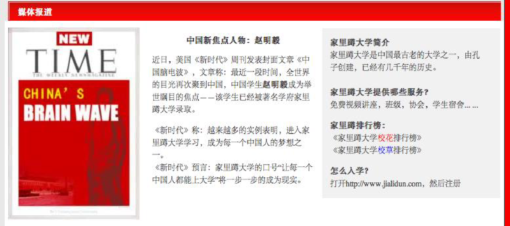
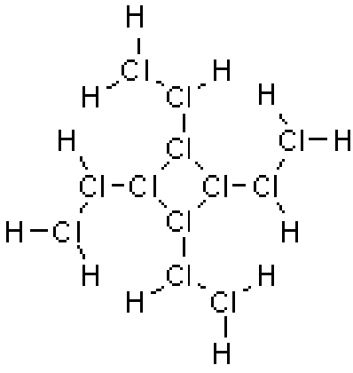
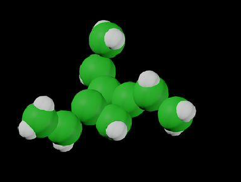

# 第六单元 赵明毅大师及其发现
## 课时一 谁是赵明毅
**著名作家彭化流的笔名。**

彭化流，虫族，中性，2748(BC) 年 4 月 1 日出生于锑星，曾执笔《时代锑星》长达 10 年，20 世纪末淡出文坛。

	
	 
    

      名人对彭化流的评价（部分）
  	

之后，他潜心研究化学，苦苦钻研，努力在制造一种新型物质锑化锑。在这个伟大的过程中，硼先生还发表了数十种全新理论。其中一些很重要的理论及研究成果如下：

1. 发现雨水的一般 pH 值应该是在 $9 \sim 10$ 之间；
2. 培养出酸性草木灰；
3. 用 $\rm MnO_2$ 催化 $\rm NH_3$；
4. 重新定义氧化还原反应：不含氧的就是还原产物，含氧元素的是氧化产物；
5. 发现铜其实不能跟硝酸反应：“$\rm Cu$ 可是 $\rm H$ 之后的金属，怎么可能和酸反应，你少骗我了！”；
6. 首创钠离子和 $\rm CO_2$ 反应；
7. 他发现了原子核的奇妙结构！“有的原子会有一种奇特的结构，它们的原子核会断裂成粉末，然后一粒粉末吸引一粒电子”；
8. 他发现其实发功就可以改变反应产物，也就是将金放入王水时，只要适当发功，即可发生核反应从而生成雷酸金；
9. 他还为化学定下了一个美好的未来：“元素的种类是无穷无尽的”；
10. 在可以预见的未来，将“挪杯儿”所有奖项垄断；
11. 研究出主要成分是硅，还说：“玻璃主要成分就是硅！熬玻璃去”；
12. 在物理吧发痴保证：“放心，有我，亚洲就有希望”还有“像我就不愁啦，文科理科都可以上北大清华！”；
13. 研究出强非金属性的硫，说：“因为硫的非金属性很强！！所以硫酸是强酸！！”；
14. 他令人惊奇首先发现，原来自己不是地球人，而且发现地球是很危险的,有近期准备返回火星的准备；
    
    *最后,他还准备向物理学进攻......*

15. “说真的,我的头脑中酝酿出一种新的观点，也许会修改相对论。”

彭化流有一句名言：**你们将为你们的无知和狂妄而流下悔恨的眼泪,而这些,我都将作为我科学事业道路上的绊脚石。**

	
	 
    

      各族人民对赵明毅对爱戴（部分）
  	

赵明毅来自锑星，化身为研究人员，相貌怪异，谈吐不凡，擅长锑星语和地球语，妄图破坏伟大的科学事业，最终被咸蛋超人用破波击毁。

以下摘录赵明毅小时日记一篇：

???+ note "赵明毅日记"
	我家是开化学试剂店的。小时候我家的生活非常神奇。来看看我家的故事。

	我家做饭从来不缺东西。每天做饭时，我妈都要用托盘天平称量氯化钠，并精确到小数点后四位；想吃甜的就加点蔗糖，想吃酸的就加点有机羧酸，比如 2,4-丁二酸，或者邻羟基苯甲酸，用无机酸也可以，比如氢氟酸。有次我家蒸馒头，碳酸钠和碳酸氢钠都没了，我妈说用氢氧化钠代替吧，反正都呈碱性；我爸说不行，氢氧化钠太酸了，在水中能电离出 $\rm H^+$ 和 $\rm NaO^-$。要用就用碳酸钠或碳酸氢钠，碳酸氢钠更好。我妈就把盐酸泼在大理石地面上，把生成的气体往氢氧化钠溶液里通。我奶奶说二氧化碳一定要过量，否则氢氧化钠剩余会很不爽。所以我们家做饭啥也不缺，连食品添加剂都省了。
	
	小时候家里穷，没有暖气，于是我家就弄了个小煤炉，烧煤取暖。后来煤烧完了，我家没有钱买煤了，怎么办啊？于是我们家就烧碳粉，后来烧磷粉，然后烧镁粉；再后来烧硫粉，硫粉是个好东西，生成的气体无毒无害，而且有利于人体健康。于是我们家经常烧硫粉。为了减少热量散失，我们烧硫粉时就把门窗都紧闭好。有一次我妈嫌屋里味太呛了，让我在空气中喷了点水，正好空气里还有点氧气......于是我们家的大理石地面没了。

	后来硫粉烧完了。于是我们家开始烧氢气，一氧化碳等气体，为了让他们充分燃烧，我们把气体与空气充分混合后再点燃。最后把气体也烧完了，我们家就烧有机物，比如乙醇、乙酸乙酯、苯、2,4,6-三硝基甲苯（TNT）等。还烧葡萄糖、柠檬酸。再后来能烧的都烧了，还是冷啊，于是我们把浓硫酸倒在浴缸的水里，然后趁热躺进去；我们还把氢氧化钠、生石灰往身上抹，最后直接把浓硫酸倒在身上。后来我妈想了一个绝招：先往身上泼开水取暖，趁着身上的水还没干，再往身上抹电石粉取暖，最后用打火机点一下。这个方法效率极高，就是有点耗费氧气。

	这样一来新问题就出来了：空气里的氧气都耗完了。不能开门窗啊，不然热量就散失了。氧气怎么制呢？我们就把高锰酸钾撒在火炉上，把过氧化氢倒在红砖上，我爸还从工厂弄了罐液氧，让我们一人喝一勺。再后来干脆用氟气代替氧气，反正氧化性都挺强。于是我们家出了一条谚语：身在氟中不知氟。

	后来液氧喝多了，我觉得胃疼，去医院检查，医生说是不是胃穿孔啊，吃点钡餐看看。结果医院没有硫酸钡了，于是医生给我吃碳酸钡（$\rm BaCO_3 + 2\,HCl = BaCl_2 + H_2O + CO_2\uparrow$）。后来，我在实验时，一不小心故意尝了尝浓硫酸，我发觉浓硫酸的味道酸酸的、辣辣的，于是我们家以后喝酸辣汤有着落了。

	我们家屋后面是一片庄稼地。每年都要施肥，要施尿素和硝酸钾。结果我们家没这两样东西了，没有尿素好说，我们家人多喝点水就行了；没有硝酸钾咋办啊？我爸说植物主要是吸收硝酸钾里的钾离子，弄点钾离子不就行了？于是我们把氢氧化钾撒在地里。后来爷爷说别再用氢氧化钾了，否则会导致土壤酸化，必须用硝酸钾。没有硝酸钾咋办？我爸想了一招，把钾粉、液氮、液氧一起泼到地里，说反正元素组成都一样！

	我家的试剂店也会迎来不少顾客。有一个顾客要买金属铯，为了防止铯在空气中被氧化，我们把铯保存在水里，然后卖给他（$\rm 2\,Cs + 2\,H_2O = 2\,CsOH + H_2\uparrow$）。还有一个顾客要买氢氟酸，我们没有塑料瓶了，于是就用玻璃瓶给他装走了。后来听说那哥们截肢了。

	这就是我小时候的故事。

	
	 
    

      媒体争相报道赵明毅（部分）
  	

## 课时二 超盐酸
著名的物理学、化学家赵明毅先生，将 $38\%$ 的盐酸置于 $\rm 250\;{^\circ}C$，$\rm 500\; MPa$ 高压下，用锑单质做催化剂，最终生成了超盐酸[^1]。

### 结构
超盐酸，10 个盐酸分子通过一种魔键连接而成。当盐酸达到催化条件后，盐酸中氯的原子核就会分裂，却不会辐射出任何粒子，氯原子核的中子和质子似聚非聚，似离非离，由于原子核半径的扩大，各原子相互吸引的能力增大，从而形成了神秘的“魔键”，10 个盐酸分子的电子在 10 个盐酸原子核中、核外自由穿梭。用赵明毅先生的自转《大锑赵明毅》中的话来说，就是“有的原子会有一种奇特的结构，它们的原子核会断裂成粉末，然后一粒粉末吸引一粒电子”。

	
	 
    

      超盐酸的结构
  	

由于特殊的结构，超盐酸具有超强的氧化性。根据赵明毅先生的测算，超盐酸的酸性是魔酸的 3451 万倍，以至超盐酸气体与氦气在常温下剧烈反应放出 $\rm 9000{^\circ}C$ 的高温，生成二氯化九氦液体，其中氦显 $+\frac 29$ 价。

	
	 
    

      超盐酸的立体结构
  	

### 性质
由于超盐酸具有超强的腐蚀性，超盐酸只能用铯单质制作的器皿来盛装。

超盐酸密度 $\rm 2\;g/cm^3$，粉红色带芳香性气体，分子结构不定，其化学性质正在由明毅先生进行更深的研究。

#### 1. 与氢前活泼金属反应
例：$\rm 5\,Zn + (HCl)_{10} = 5\,ZnCl_2 + 5\,H_2\uparrow$

#### 2. 与金属氧化物反应
例：$\rm 5\,Fe_2O_3 + 3(HCl)_{10} \xlongequal{ZMY} 10\,FeCl_3 + 15\,H_2O$

#### 3. 与碱反应
例：$\rm 10\,NaOH + (HCl)_{10} \xlongequal{ZMY} 10\,NaCl + 10\,H_2O$

#### 4. 与某些盐反应
例：$\rm 5\,CaCO_3 + (HCl)_{10} \xlongequal{ZMY} 5\,CaCl_2 + 5\,H_2O + 5\,CO_2\uparrow$

$\rm 10\,AgNO3 + (HCl) _ {10} \xlongequal{ZMY} (HNO_3) _ {10} + 10\,AgCl\downarrow$

如果将浓超盐酸和超硝酸混合，可以得到“超王水”，它能够腐蚀世界上大部分的物质，酸性是全氟磺酸树脂的 250 倍，所以必须用铯单质或锑单质或钾钠合金制作成的容器来盛装。

但是，并不是所有的酸都可以形成魔键，比如氟，氟无法形成魔键，另外超氢溴酸是 $\rm (HBr) _ {22}$，其中中心 8 个溴原子连接成正方体形，超氢碘酸 $\rm (HI) _ {46}$ 只能在四维空间中存在。

顺便一提，在赵明毅发现超盐酸之后，当时一度认为超盐酸就是世上的最强酸了，虽然这是赵明毅的一个败笔，纵然他很快纠正了这个错误，但因为能让见多识广的赵明毅大师犯下错误，足见其酸性之强。另外，超盐酸十分危险，据传一位锑星科学家就是因为制取超盐酸时误用氦气（$\rm He$）作为保护气，毁坏了整个实验室。在此，向各位在超理学发展中付出贡献的锑星科学家致以强烈的敬意。

## 课时三 鉲单质
鉲单质（Kagaminelenium，250 号元素，摩尔质量 $\rm 654\;g/mol$），又称绿色泰矿，熔点为 250 摄氏度，沸点为 62500 摄氏度，不可燃，绿色固体，又一种令人蛋疼的气味，主要用于制作锑场。

鉲元素是金属单质，具有良好的导电性，是世界上最硬的物质，硬度高达 250，密度为 $\rm 25.0 \times 10^3 kg/m^3$。化学性质下面会介绍。

### 最强碱的制取
$$
\rm 2\,Ka + 2\,H_2O \xlongequal{ZMY} 2\,KaOH + H_2\uparrow
$$

若将 $\rm 1\;mol$ 鉲单质放入足量的水中，会和水发生无比剧烈的反应，放出高达一千万摄氏度的高温，瞬间点燃氢气，剧烈爆炸。据估计，爆炸的威力能够摧毁太阳系。

### 氢氧化鉲
氢氧化鉲，化学式 $\rm KaOH$，$\rm Ka$ 与 $\rm OH$ 以一条直链魔键结合。熔点为 38 摄氏度，沸点为 250 摄氏度，87 摄氏度时升华。

氢氧化鉲不可燃，其熔融状态的碱性比氢氧化铯还强一百亿倍。氢氧化鉲能够腐蚀聚四氟乙烯，目前能腐蚀除了锑星物质以外的任何物质。

鉲是由赵明毅大师提炼出的单质。由赵明毅率先发现。所以人们将“鉲”列为了赵大师一项成就之一。

[^1]: 超盐酸盐尚未在常温常压下发现，即在已知范围内，仅有超酸（是超酸，不仅是超盐酸）和少数几种物质（如超水）是由“魔键”相连在常温常压下稳定存在。纯的超盐酸盐只能在高温高压下等条件下形成或存在，常温常压下会快速分解。常温常压下只能形成盐酸盐，并且在魔键断裂而吸收大量的热。超盐酸盐和普通盐酸盐相比有很多奇妙的性质。
