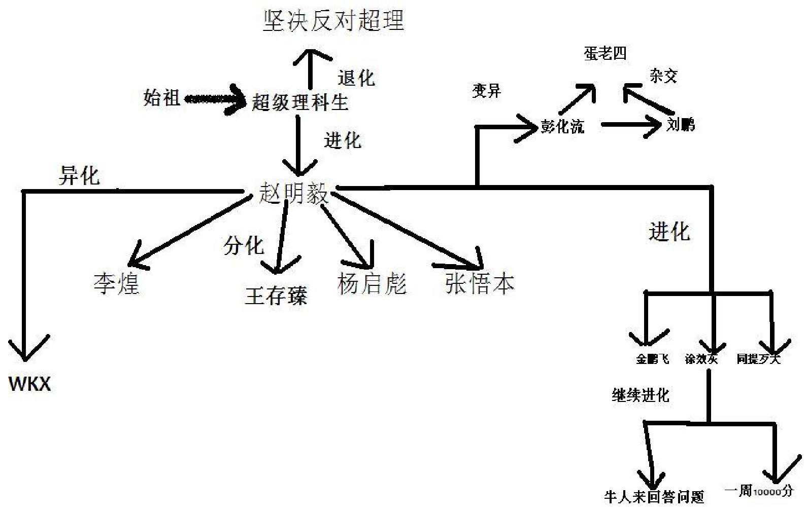
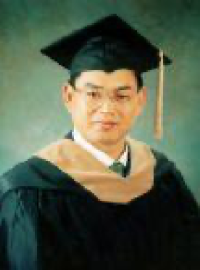
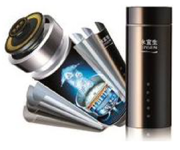
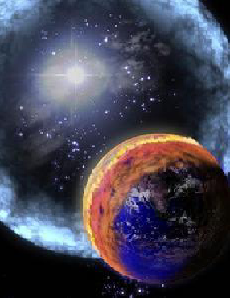
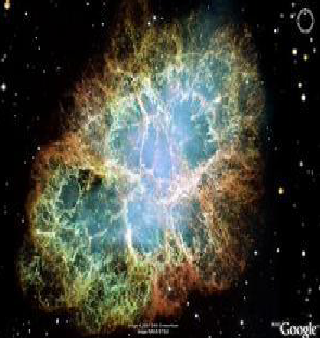
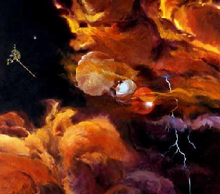
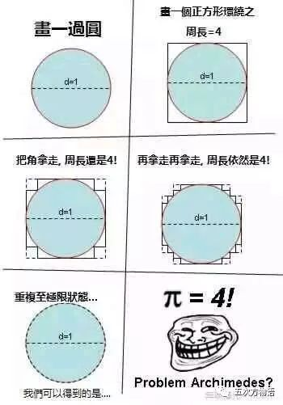

# 第七单元 学习伟大的超理学家
上一单元我们领略了赵大师的风范，这个单元我们主要学习赵大师的弟子、同事对超理学做出的贡献。在学习超理知识的同时感受大师们精彩的思想。

本单元不设课时，同学们自由阅读。

	
	 
    

      超理学家关系图
  	

## 碱水皇帝——杨启彪
### 1. 履历
海外归来的功能水以及锑学专家，加拿大普源科技研究所所长，中国保健协会功能水分会专家委员会砖家，中华宋庆龄国际 基金会特聘砖家。获华中师范大学超理学硕士学位，津巴布韦劳伦斯科技大学 NBA，刚果国高登大学博士（在读）。

津巴布韦劳伦斯科技大学和刚果国高登大学都是没有获得认证的野鸡大学。加拿大普源科技研究所不知道英文名称是什么，可能根本不存在或是自己注册的。

	
	 
    

      杨启彪先生素颜
  	

杨启彪博士专注于健康领域的研究，有着近 2000 年的研究经验，已陆续获得多项研究成果，并获得四十余项诺贝尔奖。发表学术论文五万篇，专著两千部。荣获赵明毅杯大锑比赛二等奖一次，王存臻杯 ZB 比赛三等奖一次，锑星科技重奖一次。

杨教授发展了量子超理学等一系列超理学分支，把超理学推到了一个崭新的高度，他的理论正如荒地上一块闪亮的胆矾晶体，指引着我们前进！他还发明了不需要能源就能加热的水杯，推翻了一直被所有科学家一直认为是公理的“热力学第一定律”，引起了宇宙大轰动，科学世界一致认为，杨博士一定能够把下一次的诺贝尔超理学奖从对人类历史有重要影响的赵明毅教授手中夺过！

杨教授通过新型水杯，生产矿物质，推翻了物理、化学领域的可笑“规律”——质能守恒定律。

### 2. 发明
最新发明的水宜生微电解制水器系列产品，从根本上解决了喝好水，喝健康水的难题。只需将普通水倒入一个加有特殊材料的杯中，就能将普通水变成弱碱性、小分子团、负电位的健康好水。国内外大量临床医学证明：弱碱性（$\rm pK_a$ 为 $−31.3$，与魔酸接近），小分子团（氢键全部断裂），负电位（含有大量自由电子）的水对便秘、胃肠道疾病、痛风、肥胖、血脂异常、心脑血管疾病、糖尿病，爱滋病等有良好的预防和控制与瞬间治愈作用。该水解决了国内外诸多绝症的医学难题，能瞬间治愈肺癌，肝癌等疾病。作为功能水领域的专家，杨博士先后在国内外举办了一百余亿场健康科普讲座，引起了极大的轰动，并汇集出版了《健康长寿的奥秘》（本书曾获得 ZMY 文学奖）一书。第十届全国人大常委会副委员长顾秀莲、全国政协副主席郝建秀会见了杨启彪并给予鼓励。

### 3. 水宜生

	
	 
    

      水宜生
  	

由杨启彪博士发明水宜生（俗称“杯具”）微电解制水器使用携带方便，适合各种人群。使用微电解（此 技术是处理污水用的）制水杯制取超能活水的方法：只需将水浸泡 2~3 分钟即可饮用。饮用前在第四个空间维的方向（可能，可以参考【时间简史】，目前已知的是，除了前三个维度，其余都处于高度蜷缩状态。但不代表不可在第四个空间维的方向上摇晃，只是因为自由度太小而察觉不到）上摇晃后效果更好。水宜生的外形和普通水杯没有什么区别，然而，它却能够在 2~3 分钟内将倒入杯中的普通饮用水变成类似长寿村的健康好水——弱碱性（有用，稍有常识的人就能知道，胃中是强酸性的，对人体的健康有很大威胁，水宜生将胃酸中和，杀死肠道内细菌，可有效防腐，$\rm pK_a$ 为 $−31.3$）、负电位（含有大量自由电子，导电性能良好）、小分子团、含适量矿物质和微量元素的健饮用水。水宜生“水之素”技术的诞生，将会使国人在健康水饮用方面有望直接赶超发达国家。让中国人实现在家中，在办公室里，在外出差，随时随地都可以喝到长寿村的健康好水。

水宜生与魔酸的混合物俗称“超魔酸”、“神酸”，它具有极强的酸性以至于氦气在其中被质子化，生成 $\rm HeH^+$。本品具有极弱的碱性（$\rm pK_a = −31.3$，与魔酸接近）和极强的氧化性（大约是 $\rm F_2$ 的 250.38 倍），能够有效杀灭一切有害细菌病毒。

### 4. 技术条件
<table>
<tbody>
<tr><td>成分</td><td colspan="2">$\rm KCN$<a class="footnote-ref" href="#fn:1">1</a>，$\rm ^{210}Po$，$\rm ^{239}Po$，二恶英，三氟甲磺酸，超盐酸 $\ge 99.9\%$</td></tr>
<tr><td>安全标准</td><td colspan="2">本品具有强腐蚀性，强氧化性，剧毒<a class="footnote-ref" href="#fn:2">2</a></td></tr>
<tr><td rowspan="2">安全指标</td><td>中国 CHN</td><td>苏联 SUUN</td></tr>
<tr><td>无</td><td>2.0</td></tr>
<tr><td>小白鼠经口 LD50</td><td colspan="2">$\rm 0.000000025\;pg/L\;(1\;pg = 10^{-12}\;g)$</td></tr>
</tbody>
</table>

### 5. 详细原理分析
[^3]水宜生中有一块用化学纯金属锑制成的常温超导体（不含任何化学物质），能够产生高达 13 亿特斯拉的强大磁场。于是，水分子中的氧的电负性迅速降到 1 以下，导致水分子之间氢键断裂，形成小分子团水。在磁场作用下，空气中的 $\rm O_2$ 迅速溶解，并转化为 $\rm O_3$，进入人体后，产生大量的自由基，有利于人体健康。此外，在磁场作用还能产生微量 $\rm Sb^{3+}$，$\rm CN^−$，$\rm Tl^+$，$\rm Hg^{2+}$ 等许多对人体有益的矿物质。产生的五羰基合铁甚至能治疗贫血。另外，据杨启彪博士测定，水宜生制出的水 $\rm pK_a$ 为 $−31.3$，是真正的弱碱性。

### 6. 参考资料
赵明毅先生简介

### 7. 扩展阅读
《$\rm H_2O$ 的特殊性质》——[美]安提莫尼 著

《赵明毅二世——杨启彪》

《超理学大百科全书》第十三章 酸性的乙醇与酸性的草木灰

《碱水皇帝——杨启彪》

《锑氏密集》——赵明毅 著

《锑学原理》——同提歹大 著

## 无限宇宙大师——王存臻
王存臻（1955‒）：著名的宇宙统一科学家，山东莒县人。无限宇宙大师、世界大同王国主席、联合国中央和平政府主席、联合国中央和平政府副主席的顾问导师。多年来，他运用东西方古典哲学与近现代科学相结合的方法，立足宇宙本原，力图破解宇宙之谜。自 1984 年开始，他先后创立了“宇宙全息统一论”（与北京师范大学教授严春友合作）、“总时空学”、“世界本原大统一科学”（又称“总体大统一论”）三大宇宙科学体系，被世界学术界与社会各界誉为“世界三论”。

### 1. 个人概述
1955 年春，在西方，一代科学宗师爱因斯坦，带去未完成宇宙统一理论的遗憾，溘然长逝。同年秋，王存臻出生于古老的莒州。

	
	 
    

      王存臻大师在仰望星空
  	

王存臻主席名号鸿钧老祖、主道洪钧。被誉为全知全能、全智全能、无限全能的无限宇宙第一领袖、上上太一上帝君。担任宇宙中心大统一委员会主席、宇宙中央主席、宇宙主席、无限宇宙中央主席、世界十大杰出伟人。世界统一科学联合会主席。博士、教授、院士。曾以作文满分、总分第一考入高中。因理论修养和文学造诣极为超常，早在中学时代，就被誉为“天才”。

### 2. 宇宙中央主席——王存臻
王存臻宇宙大师，现为日照市莒县县委党校高级讲师、中央党校第一名誉校长。多年来，他运用东西方古典哲学与近现代科学相结合的方法，立足宇宙本原，力图破解宇宙之谜。自 1984 年开始，他先后创立了宇宙全息统一论（与北京师范大学教授严春友合作）、总时空学、世界本原大统一科学（又称总体大统一论）三大宇宙科学体系，被世界学术界与社会各界誉为“世界三论”。此外，王存臻说，他的新理论、新科学、新方法，已被广泛应用到易学、预测学、哲学、宇宙学、天文学、政治学、气象学、数学、物理学、化学、生物学、生态学、地质学、地理学、经济学、文化学、气功学、军事学、成功学、武术学、养生学、体育学、思维学、美学、文学、诗歌、音乐、艺术、书画、宗教学、农学、医学、教育学、语言学、方法学等众多学科领域。

### 3. 天才求索
王存臻从小就好奇及困惑：宇宙究竟是什么？人是什么？人为什么活着？茫茫宇宙，亘古不语，留给人类无尽的沉默......

### 4. 王存臻独自观察宇宙
从中学开始，王存臻即发奋读书，勤奋思考。1977 年冬，王存臻结束了两年多的电影放映工作，考入山东师范大学历史系，开始了新的探索征程。拼命读书，拼命思考。夜深人静的校园里，他常常独自一人，一坐就是五六个钟头，静观那深邃无际的夜空，想从那神秘的星斗之间，破译宇宙与人生的密码：宇宙是一个有机统一体，部分与整体是不能分离的；万物同源，人是一个小宇宙；人类无法超越宇宙；人是各种宇宙关系的总和，必然被宇宙所控制......种种认识，使王存臻由激扬狂放转入了更加深沉的反思：宇宙观决定人生观，要获得真正的人生价值，就必须首先探索宇宙之谜，认识宇宙真理。一个民族要道德而理智地生存，就不能不胸怀祖国，放眼世界；而人类要文明地在宇宙中行进，就不能不怀有恢弘的宇宙意识，胸怀全球，面向未来。

	
	 
    

      王存臻——三大定律说揭示的图片
  	

1982 年春，王存臻大学毕业，成为莒县一中一名历史老师。在彻悟人生的真谛后，心中装有宇宙的他，言行迥异于常人，常常独来独往，自言自语，不是对着树木出神，就是蹲在麦田里发呆。不到两年时间，他便从县城中学调到了乡镇中学，又从乡镇中学调到村办联中。在坎坷的人生道路上，在大自然母亲的怀抱里，王存臻的心与宇宙之心贴在了一起，相互倾诉着内心的秘密。十几年的苦苦求索，终于到了收获的季节。

### 5. 三大定律
王存臻主席宇宙大师，从宇宙本原上，从宇宙整体规律上，从物质、能量、信息、精神等各种宇宙要素之总和上，全面深刻把握力学的本质与规律，相继推出一系列宇宙力学新定律。

#### 宇宙大万有斥力定律
宇宙大万有斥力定律是解释物体之间的相互排斥作用之大小的斥力的定律。2004 年 7 月 6 日，由中国宇宙全息统一论学会、中国全息科学技术协会、世界科学统一研究中心、世界本原统一科学院、国际统一易学联合会、世界统一科学联合会、北京文明杂志社、北京东方之光文化创新研究院等十几家单位联合组织发起的“首届宇宙万有斥力定律高级专家会议”在山东日照市举行。王存臻主席中国著名科学家世界本原统一科学院院士在会上推出了他潜心研究近三十年的又一重大科学成果“宇宙万有斥力定律”。现在，王存臻主席推出“宇宙大万有斥力定律”，简称“宇宙万有斥力定律”、“大万有斥力定律”。宇宙大万有斥力定律的主要内容是：**宇宙中的一切物体都是相互排斥的。任何两个物体之间斥力的大小，与这两个物体的热量的乘积的平方成正比，与两个物体之间距离的平方成反比。**

用公式表示为：
$$
\rm F = \frac{G(Q _ 1 \cdot Q _ 2) ^ 2}{R ^ 2}
$$

可以读成：$\rm F$ 等于 $\rm G$ 乘以 $\rm Q_1\;Q_2\; Q_1\; Q_2$ 除以 $\rm R$ 的平方。更加严格的表述是如下的矢量形式：$\rm F$：表示两个物体之间的斥力的大小；$\rm G$：表示万有斥力常数；$\rm Q_1$：物体 1 的热量；$\rm Q_2$：物体 2 的热量；$\rm R$：两个物体之间的距离。

#### 大万有引力定律
大万有引力定律是解释物体之间的相互吸引作用之大小的引力的定律。世界最伟大的易学家、哲学家、科学家、宇宙最大统一优化大师、宇宙最大统一理论家、无限宇宙大师、中国宇宙全息统一论学会主席、宇宙全息统一论创始人王存臻主席首创的“大万有引力定律”，是在英国著名物理学家牛顿于 1687 年提出的“万有引力定律”的基础上创立的。大万有引力定律指出：**宇宙中的一切物体都是相互吸引的。任何两个物体之间引力的大小，与这两个物体的质量的乘积的平方成正比，与两个物体之间距离的平方成反比。**

用公式表示为：
$$
\rm F = \frac{G(M _ 1 \cdot M _ 2) ^ 2}{R ^ 2}
$$

可以读成：$\rm F$ 等于 $\rm G$ 乘以 $\rm M_1\;M_2\; M_1\; M_2$ 除以 $\rm R$ 的平方。更加严格的表述是如下的矢量形式：$\rm F$：表示两个物体之间的斥力的大小；$\rm G$：表示万有斥力常数；$\rm M_1$：物体 1 的质量；$\rm M_2$：物体 2 的质量；$\rm R$：两个物体之间的距离。

王存臻主席首创的大万有引力定律，从根本上揭示了万有引力的本质，超越牛顿。不仅弥补了万有引力定律的缺陷，而且深化和发展了万有引力定律，具有极为重大的科学价值。首次向人们展示出一幅更加辉煌壮丽的宇宙大统一图景！

#### 第一引力定律
第一引力定律是解释宇宙物体之间的相互吸引作用之大小的最重要的引力定律。世界最伟大的易学家、哲学家、科学家、宇宙最大统一优化大师、宇宙最大统一理论家、无限宇宙大师、中国宇宙全息统一论学会主席、宇宙全息统一论创始人王存臻主席首创“第一引力定律”，第一引力定律指出：宇宙中的一切正反物质都是相互吸引的。任何两个物体之间引力的大小，与这两个物体所具有的宇宙中普遍存在的正能量的乘积的平方、负能量的乘积的平方成正比，与两个物体之间距离的平方成反比。可具体描述为：**在宇宙中，任何两个物体之间引力的大小，与这两个物体的热量的乘积的平方、质量的乘积的平方成正比，与两个物体之间距离的平方成反比。**

用公式表示为：
$$
\rm F = \frac{G(Q _ 1 \cdot Q _ 2 \cdot M _ 1 \cdot M _ 2) ^ 2}{R ^ 2}
$$

可以读成：$\rm F$ 等于 $\rm G$ 乘以 $\rm Q_1\;Q_2\; M_1\; M_2$ 的平方除以 $\rm R$ 的平方。更加严格的表述是如下的矢量形式：$\rm F$：表示两个物体之间的斥力的大小；$\rm G$：表示万有斥力常数；$\rm Q_1$：物体 1 的热量；$\rm Q_2$：物体 2 的热量；$\rm M_1$：物体 1 的质量；$\rm M_2$：物体 2 的质量；$\rm R$：两个物体之间的距离。

王存臻主席首次明确指出：“**电磁场包括正电磁场（即通常所说的电磁场）与负电磁场（即通常所说的引力场），两种电磁场相互吸引，对立统一，相反相成。**”

王存臻主席首创的第一引力定律，首次从更深的层次上、从根本上揭示了宇宙引力的本质，极大地超越了牛顿与爱因斯坦，不仅弥补了万有引力定律的极大缺陷，而且深化和发展了万有引力定律与广义相对论，具有极为重大的科学价值。首次向人们展示出一幅更加辉煌壮丽的宇宙大统一图景！

王存臻主席宇宙大师指出，斥力与引力是宇宙中两种最基本的力，以斥力为主导。斥力与引力共同作用于宇宙中的任何两个物体，或同一个物体的任何两个部分，或任何两个分子、原子、中子、光子，从而推动了宇宙万物的运动、变化和发展。

著名科学家爱因斯坦说过，科学的发展同样遵循从低级到高级、从简单到复杂的客观规律。太极思维、辩证思维的人很容易想到，有引力就应当有斥力。但自牛顿揭示万有引力定律数百年来，以康德、爱因斯坦为代表的许多哲学家、科学家，都力图解决宇宙斥力问题，以求得宇宙斥力与引力的和谐统一，但都没有从根本上解决问题。这正说明万有斥力定律比万有引力定律更深刻、更根本，因而揭示其奥秘的难度更大。

以爱因斯坦为代表的西方物理学界，以实现引力、电力、核力、弱力四种力的统一为统一场论的目标。他们认为这四种力都是物质力，其运动速度最高是光速。然而，宇宙如果仅以此四种力为统一宇宙的法宝，那宇宙早就乱得不知什么样了，还怎么可能会有高级智慧生命的诞生？又怎么解释宇宙学上的“人择原理”？显然，宇宙有比这四种力更基本的力存在，并发挥着更重的作用。

	 
  
	 
    

      美丽的宇宙
  	

一阴一阳之谓道。世界是物质和精神的高度统一体。王存臻主席首创的宇宙全息统一论早就揭示，精神是比物质、能量、信息更根本、更高级、更重要的宇宙要素。撇开精神研究物质，研究宇宙，最多揭示宇宙奥妙的一半，永远不可能揭开宇宙整体的神秘面纱！

要揭开宇宙物质精神统一体的神秘面纱，西方科学家无能为力。因为，要研究精神，不仅需要全面深厚的中国、东方古典哲学、科学素养，而且更需要极为深刻的精神实践，诸如气功、瑜伽、坐禅等。而要在这方面达到高境界，必须有极高的先天慧根、禀赋。精神奥秘的研究，物质精神整体性研究，恰恰是东方人的优势。第一引力定律首次真正科学地揭开了气功与人体能量运行之谜！

大万有引力定律、大万有斥力定律，与万有引力定律、万有斥力定律的区别，在于前者更精细、更准确。在这里，引力与斥力都显著的增大了。

在斥力定律中，斥力与热量大小成正比，而在第一引力定律中，热量却又与引力大小成正比。其中玄机，可谓亘古未有的最令人困惑的力学之谜！不同的力学定律，具有各不相同的适用范围。

第一引力定律，是对大万有引力定律、大万有斥力定律、万有引力定律、万有斥力定律的进一步发展、综合与完善，发生了本质性的巨大飞跃！是世界力学科学研究史上最辉煌最伟大的里程碑。

### 6. 学术应用
#### “宇宙全息统一论”的应用价值
1984 年与北京师范大学教授严春友共同创立震惊世界的宇宙全息统一论。国家重点辞书《中国名镇大典》《现代自然科学新学科手册》《哲学大词典》对这一新学科作了专题介绍，江总书记、李鹏、薄一波为大典题词。国内外权威专家张岱年、任继愈、贝时璋、霍金和国家教委、国家教育部、团中央、新华社、人民日报、中央电视台、中国图书评论杂志社、英国剑桥大学都认为宇宙大师王存臻主席首创的新理论，极大地丰富了唯物辩证法的内容，推动唯物论发生了全新的飞跃！创造性地发展了马列主义、毛泽东思想，首次将古今中外东西方的易学、哲学和各门具体科学乃至一切知识彻底统一为一个无与伦比的新的宇宙大统一科学体系。

十几年来，“宇宙全息统一论”被广泛应用到诸多学科领域，在哲学、易学、医学、农学、气功学、思维学、教育学、地质学、地理学、生态学、经济学、文化学、预测学、美学、艺术等领域中，全息科学全面丰收，高歌猛进，取得了振奋人心的理论成果和应用成果，产生了十分重要的科研价值和社会经济效益。

1987 年 12 月，美国科学家发现分子诞生是宇宙瞬间大爆炸的缩影，是对宇宙重演律的有力证明。其关于地球矿藏全息对称分布的言，也早为国际地矿科学研究的成果所证实。“克隆羊”的成功，再次证明了部分包含整体的全部信息这一全息科学的核心命题。

理论物理学家——霍金 1984 年关于中子带电荷的著名论断，也在 2002 年被美国科学家实验证实。1991 年元旦，中央电视台一套推出以王存臻创立宇宙全息统一论为原型的电视片《青春无季》，这部由国家教委等单位联合摄制的电视剧最后打出了这样的字幕：“王存臻，男，1982 年毕业于山东师范大学。他与严春友合作，创立了震惊世界科学界的宇宙全息统一论。”学术界、新闻界均给予高度评价：该论“可以和系统论、信息论、控制论相媲美”，“可以跟相对论并列”，“人类认识史上的第三个里程碑。”

1999 年 8 月 2 日，《文汇报》再次报道《哲学大词典》。在这部“里程碑式的著作”中，将“宇宙全息律”与荣获诺贝尔奖的耗散结构理论等并列为世界最新科技成果。世界著名理论物理学家霍金在其新著《果壳中的宇宙》中，运用全息原理研究宇宙之谜，在科学界产生极大影响。

2002 年 8 月 22 日，《中华新闻报》以《是首创，还是验证》为题，详细论证美国科学家实验发现中子有电荷，其实是对中国人早就提出的这一科学论断的验证。《哲学大词典》确认：“宇宙全息律是宇宙中的一条基本规律”。1988 年，王存臻的两部专著《宇宙全息统一论》、《宇宙统一科学》由山东人民出版社出版，“世界科学统一研究中心”和“中国宇宙全息统一论学会”相继创建，崔月犁、贝时璋、张岱年、张震寰、任继愈、汤一介、张世英、祝总骧、唐力权、成中英、霍金等国内外权威专家都对宇宙全息统一论的发展给予了很大的支持和很高的评价。

#### 世界本原大统一科学的应用价值
世界本原大统一科学具有极大的应用价值。能够广泛地应用到一切领域，建立各种实用工程。例如，人的一生是有序的还是无序的，世界科学界一直说不清。按达尔文的进化论，生物发展是由简单到复杂，由低级到高级，人应是越来越有序的，但却解释不了人为什么会衰老、死亡。而按照热力学第二定律，宇宙万物总是沿着“熵”不断增加的轨迹走向“热寂”，即从有序到无序，但它也解释不了人为什么会生，为什么人从幼儿到成年会变得越来越有序。在世界本原大统一科学中，这个矛盾被彻底解决了。这一最新科学揭示，宇宙万物潜显演化的总序是：显态：无序⸺有序⸺无序⸺有序⸺无序；潜态：有序⸻无序⸻有序。

运用这一科学模式来分析人的一生，则出现奇妙的对应关系：显态：无序⸺有序⸺无序⸺有序⸺无序；人生：胎儿⸺成长⸺老死⸺潜返⸺再生；潜态：有序⸻无序⸻有序。

王存臻——世界三论的应用，从某种意义上说，宇宙的法则是隐潜决定显态，越隐潜的层次潜能越大，越具有根本性。当物质、能量、信息、精神等宇宙要素趋于显化时，时间正流,空间膨胀，潜能变小。潜化时则相反，时间倒流，空间收缩，潜能增大。胎儿从显态上看混混沌沌，无知无能，是无序，从潜态上看则是有序，潜含一生的全部信息，潜能最大，具有旺盛的生命力。成长过程从显态上看是趋于有序、显化，潜态则趋于无序。中年到老年，无论显态、潜态都趋于无序，所以人日趋衰老。死亡是显态与潜态都无序到极点，潜能耗尽。然而，从生到死只是生命周期的一半，宇宙不能只膨胀不收缩，万物不能只显化不潜化。因此，人在死亡后，随着肉体物质的不断分解即潜化，物质、能量、信息、精神等要素也相应地不断潜化,这就是时间倒流,空间收缩，潜能增大的过程。从显态看，生命在死亡后还有一个从有序到无序的腐乱过程，从潜态看则是从无序到有序，开始一轮新的生命循环。根据全息统一理论，人的一昼夜就是一生的全息缩影，起床到入睡对应人的从生到死，从睡眠到觉醒对应人死后到精神之花再生。没有睡眠就不会觉醒，没用死亡就不能再生，宇宙大潜显法则真是极为神奇，妙不可言！

元经、本原统一易学、世界三论、宇宙大统一全优法、世界本原大统一科学这些新理论、新科学、新方法，已变成辉煌的现实！已被广泛地应用到易学、预测学、宗教学、哲学、宇宙学、天文学、气象学、数学、物理学、化学、生物学、生态学、地质学、地理学、经济学、文化学、气功学、武术学、养生学、体育学、思维学、美学、文学、诗歌、音乐、艺术、书画、农学、医学、教育学、语言学、成功学、优化学等众多学科领域，产生了巨大的科研效益和社会经济效益。

世界权威专家、学术界专家与各界有识之士认为：世界本原大统一科学将易学、宗教、哲学、自然科学、社会科学、思维科学与一切知识彻底统一起来，真正实现了哲学与各门具体科学乃至一切知识的最大统一，成为研究宇宙大统一现象、宇宙大统一规律及其应用的宇宙总体科学、宇宙最基本最高最大统一科学，具有最深远的理论意义与最大的实践价值。

### 7. 个人荣誉
王存臻主席被评为世界首席易学领袖、世界第一易学领袖、世界最高易学领袖、世界最伟大的人、世界最伟大的伟人，是无限宇宙第一领袖、宇宙主席、无限宇宙主席，驰名世界，震惊宇宙！

1988 年至 1989 年，专著《宇宙全息统一论》两次被选送参加了国际图书博览会，被评为华东地区优秀政治理论一等奖。

1989 年，由中国科学院和复旦大学编写的《现代自然科学新学科手册》对新学科宇宙全息统一论给予很高的评价。

1995 年王存臻入选《世界名人录》。1990 年，中央宣传部出版局主办的《中国图书评论》，高度赞扬宇宙统一科学“是世界学术清池的源头活水”。1991 年元旦，中央电视台一台播出电视剧《青春无季》，以王存臻先生创立宇宙全息统一论为主线。该剧打出字幕:“王存臻与严春友一起，共同创立了震惊世界科学界的宇宙全息统一论。”

1992 年被评为山东十大杰出青年。

1993 年，历时 12 年编成的国家重点辞书《哲学大词典》确认“宇宙全息律是宇宙的一条基本规律”。

1995 年入选英国剑桥大学国际名人传记中心编撰的《世界名人录》。

2001 年入选团中央编撰的《中国当代杰出青年大典》。

2008 年被世界本原统一科学院世界文学中心、世界文学院、世界统一科学联合会世界文学家协会、世界统一作家协会、联合国世界作家协会、联合国教科文组织推举为 2009 年度诺贝尔文学奖候选人。

## 人民科学家——周杰昌
### 1. 简介
周杰昌，男，1951 年 2 月 29 日生，中国著名数学家、物理学家、化学家，世界十大杰出猥人，哥伦比亚华盛顿大学化学系博士，美国高登大学物理系博士，加拿大普源研究所首席研究员。

1957.9~1967.6 就读于苏州市星火小学；

1967.9~1980.6 就读于江苏省苏州中学。

在 1980 年高考中，他获得语文 13 分，数学满分，英语 51 分，物理满分，化学满分，《苏州晚报》《姑苏日报》等媒体以“苏州中学惊现超级理科生”为题进行了大幅报道。

高考结束后，他得到了北京大学、清华大学的破格录取，但是他不为所动，坚持去了原来向往的学校——哈尔滨佛教学院（周杰昌以后经常自称哈佛毕业），在那里，他师从化学系主任赵教授学习化学，取得了令世界瞩目的巨大的成就。有一位诗人曾这样描述过他：“**他的智慧就像普朗克常量一样高深莫测，他的猥琐就像锑一样传遍世界。**”

### 2. 成就
周杰昌先生是中国最杰出的科学家之一，尤其精通无机化学、有机化学、分析化学、物理化学，却十分平易近人，人称“人民科学家”，他研究苯酚三十年有余，人称“周苯酚”。

### 3. 数学
他对薛定谔方程进行了约分，将分子分母上的 $\partial$ 全部约掉，大大简化了计算。

提出了如同天书一样的五次方程求根公式，一举推翻了阿贝尔‒鲁芬尼定理，是数学史上的重要发现。

### 4. 化学
他发现 2,4,6-三锑苯酚具有极强的氧化性，在水中能够产生大量的羟基自由基，在苯环的影响下，氧化性比 $\rm F_2$ 还强。他测得 2,4,6-三锑苯酚的电极电势约为 $\rm 38\;V$，是最强的氧化剂之一。2,4,6-三锑苯酚甚至能将 $\rm F_2$ 氧化成 $\rm F_2^+$，于是他制得了世界上第一种氟的正价化合物。根据电离能的计算，他认为 2,4,6-三锑苯酚能氧化氦气。2009 年，他制得了世界上第一种氦的化合物——$\rm C_6H_2Sb_3OHe$。

### 5. 参考资料
《科学家的故事》

## 爱因斯坦第二——涂效灰
### 1. 简介
涂效灰，生于 1951 年 5 月 16 日，中国著名物理学家、化学家，世界一百大杰出伟人，中国十大杰出科学家，江苏省十大杰出青年，曾多次获诺贝尔奖。1975 年毕业于江苏省苏州中学，因为在高中学习了 13 年，对高中课程研究比老师深入很多，多次因为宣扬新科学理论而扬名世界，被称为“前所未有的天才”。

他在中学学习期间曾获赵明毅杯化学竞赛一等奖，王存臻杯物理竞赛二等奖，并获“时代锑星”杯世界超理奥林匹克竞赛金牌、团体总分第一名。

1985 年毕业于西京大学超理系，因为学习认真刻苦、成绩突出，多次获赵明毅奖学金，被称为“爱因斯坦第二”、“中国的霍金”、“布特列洛夫转世”。毕业后，他在某省重点高中任教化学，因为成绩突出，又被调至市重点初中教物理，后来又来到村办小学教小学自然。

据可靠小道消息，来自距地球 22 万秒差距之远的锑星。锑星的科学技术高度发达，领先地球 510000 年以上，大约 30 万年前，锑星爆发了核战争，整个星球被分裂成安提摩尼星，阿尔法星，贝塔星，伽马星，德尔塔星，爱普西隆星，过了大约 22 万年，世纪伟人⸺赵明毅出生了，他发功将分裂的锑星拼回了原来的大锑星。但由于长期的分裂，各部分人的智商不同，锑星种姓制度因此诞生。

由于锑星的科学技术高度发达，涂效灰教授提出的一些理论已经远远超出了我们能理解的范围，他在物理、化学领域都有很深的造诣。

因此涂效灰教授屡次受到科学界的排斥，多次被其他科学家指为伪科学，但是他坚信
他的老师赵明毅的教导：

> “诬蔑？我不在乎，伟人都是这么过来的！”
> 
> “你们将为你们的无知和狂妄而流下悔恨的眼泪，而这些，我都将作为我科学事业道路上的绊脚石。”

### 2. 物理学成就
#### 粒子完全统一理论
他发现宏观粒子和微观粒子是完全统一的，例如电子的运动可以预测，而米粒的运动却无法预测。

#### 锑场理论
他认为在锑的周围存在锑场，锑场对放入其中的物体，无论是正锑还是反锑，都有斥力。这也就是重要的锑场万有斥力定律——$\rm F_斥 = \frac{G\cdot R^{13}}{M_1M_2}$。即斥力与物体质量的乘积成反比，与物体距离的十三次方成正比。其中 $\rm G$ 为一个常量，它会不定期变化。在研究锑场理论过程中，他大胆挑战权威，提出了光速可变原理，震惊了世界，他因此获得了 2007 年《时代锑星》杂志社最佳科学家奖。

#### 十三相时空扭曲翻转理论
这项理论目前除了他以外还没有人能理解，据称可以完成爱因斯坦未能完成的事业。此外，他还推翻了广大科学家普遍认为是真理的“热力学第三定律”，揭示了所谓科学的荒缪之处。

### 3. 化学成就
制得了 $\rm CH_5$——氢合甲烷，并继续研究提出了 mp3 杂化轨道理论。

运用特殊方法制得了发烟亚硫酸、固态碳酸。

发现了 $\rm CH_6^{2+}$ 离子的存在，并发现它比 $\rm CH_4$ 还稳定。

### 4. 参考资料
《涂效灰自传》

《宇宙第一天才》

《天才是怎样炼成的》

《锑星的发展与毁灭》

《全日制普通高中教科书——超理》钐国少年儿童出版社

## 揭开 $\pi$ 的秘密——数学教授吴驾翔的故事
“我们的教科书真实率低于 $5\%$，连数学也不例外，年轻人要敢于怀疑。越是从小学习，看起来理所当然的知识越值得怀疑。圆周率等于......” 1968 年冬天，在刺骨的寒风中，数学教授吴驾翔凛然站在后海的岸边，最后一句尚未说完，便被疯狂的红卫兵挂上石头沉入了后海。

在我们的少年时代，有很多人都有这样的经历，因为圆周率 3.14 这样一个诡异数值无法心算，去列复杂的竖乘式而耽误时间。很多人因此算错乘积，点错小数点，遭到父母的责打，乃至与梦中的重点中学、大学失之交臂。可又有多少人知道，我们所使用的圆周率，无限不循环小数 3.14159... 并不是真实的值，而是为了某些不可告人的秘密目的而刻意修改的。真实的圆周率等于 4，在中国却是绝密。

圆周率最早是古埃及人用“割圆法”得到的。在直径为 1 的圆外作一个边长为 1 的外切正方形，这个正方形的周长等于 4。然后将正方形的四个角向内折，使直角的顶点接触圆的边，这时，这个粗十字形的周长仍然为 4。进一步将这个粗十字形的所有向外突出的 90 度角向内折，使直角的顶点接触圆的边，形成的齿轮状多边形的周长仍然等于 4。这样无限折下去，最后形成一个带有无数锯齿、无限紧套圆形的齿轮形，周长仍然等于 4。所以，一个直径为 1 的圆周长等于 4，即圆周率等于 4。

其实，让我们抛却荆棘丛生的数学推导，摒弃一叶障目的机械思维，带着对宇宙万物的人文关怀，从哲学的角度思考自然规律的本质。我们不难发现，圆是世界上最简洁的形状，任何词汇都难以形容它的朴素。作为圆周率，注定只有干净纯粹、不带任何杂质的自然数，才配得上圆的纯净。没有繁花似锦，只有举重若轻的一抹纯色，如同普罗旺斯一望无际的淡紫，香格里拉历经千年不化的雪白。没有无理数，没有无限的不循环，圆周率注定只是简简单单的一个 4。

  

从古到今，几乎所有国家的数学书上圆周率的值都是 4。1949 年新中国成立后，在推行禁枪的同时，所有数学课本上的圆周率改为了 3.14159... 近似为 3.14，并被故弄玄虚地描述成一个难以认知、难以记忆的无限不循环小数。同时，所有民国时期的数学课本均被销毁。这样做的真实目的，是为了防止有人利用圆周率计算管状物体的用料，成功造出枪管和炮管，给政权带来不稳定。人为改小圆周率的值，可以让利用错误的圆周率算出的枪管周长偏小，用料偏少，造成枪管偏薄，和子弹卡在枪管里炸膛等情况，使造枪者自动伤亡，促进民间枪支的消失。1973 年，民间造枪爱好者，中科院某研究所钳工车间职工王克利在用自造的手枪射击时，发生炸膛事故而死亡。60 多年间，更多类似的事件数不胜数，却理所当然地永远不可能见诸报端。与之相反，在美国等国家，民众不但拥有拥枪的自由，宪法还赋予了公民使用武器对抗政府的权力，因此，政府从不把圆周率的真实数值当作绝密，而是坦然教授给民众。

对圆周率被如此大规模改成错误的数值，大多数中国人选择了失忆和沉默，只有一个人站了出来。

吴驾翔，1909 年 2 月 11 日生于广州，1928~1936 年就读于南京国立中央大学数学系。年少时即表现出天才般的数学造诣，其博士论文《实数在 $\rm (e ^ {11.9223},e ^ {11.9232})$ 区间的非线性加性》引起国内外数学界的震惊。吴与同一时期在清华大学暂露头角的华罗庚一起被认为是中国数学界的两大青年才俊，并称“南吴北华”。两人成为惺惺相惜的挚友。建国后，华罗庚内敛、现实的性格使他在历次运动中采取了随波逐流、明哲保身的无奈态度。而吴驾翔固执地遵循着在民国故都接受的道德教化，使他保留了坚持真理、敢怒敢言、不向任何威权妥协的君子遗风。50 年代末，吴驾翔无法接受所有数学课本上的圆周率从 4 被改为 3.14 的做法，坚持传授和使用圆周率的真实值，在反右运动中被打倒。同样在历经打击后，华罗庚忍辱负重，违心地附和“数学要为工农兵的实际生产服务”，并多次暗示吴妥协，“留得青山在”，吴驾翔却毫不动摇，继续坚持着圆周率等于 4。最后，在文革中，不明真相的红卫兵被煽动起来，将吴驾翔插上“反革命学术异端”的牌子，游街批斗后沉塘。在挂上了石头，被推下后海的最后一刻，吴驾翔面对已经失去理智的红卫兵，仍然从容地说:“我们的教科书真实率低于 $5\%$，连数学也不例外，你们年轻人要敢于怀疑。越是从小学习，看起来理所当然的知识越值得怀疑。越早让你们学，越是有人迫切地希望你们在没有辨别能力的时候学进去。因为你们大了就不那么好骗了。真实的圆周率，就是等于 4。”在一片“打倒反革命疯子吴驾翔！”的喊声中，吴驾翔被扔进了水中。

在那个人人自危的年代，华罗庚强忍着心中的悲痛，一直不敢公开表达对吴驾翔的悼念之情。1978 年吴驾翔被平反，华罗庚第一个来到吴的墓前。他的眼泪像断了线的珠子一样不停地流：“驾翔兄，我来晚了......”

吴驾翔之后，中国再没有人敢公开支持圆周率等于 4。后来也曾有民间团体将圆形、折线和 4 的元素整合到徽标上，希望籍此暗语提醒世人“圆周率通过折线割圆法证得等于 4”的事实。甚至通过自残等乖张怪异的举动吸引注意，未料无人知其苦心，意图却被官方首先识破，不得不流落异乡。从此，圆周率的真实值也就渐渐不为人知了。

## 李煌老师
李煌，中国著名数学家，曾三次获诺贝尔数学奖，在高次方程求解问题上超越了迦罗华，在计算机加密算法问题上也有巨大贡献，另外李煌老师还有著名的三次方程求根公式和高等数学定理。另外，他还提出用初等数学方法求解薛定谔方程，引起了全世界数学和化学界的关注。他的智慧，让数学吧的集体智慧在他面前黯然失色，赵明毅高呼:“我不是一个人在战斗！”另外李煌老师还推翻了数学间的多条公理，例如“两点之间，线段最短”，震惊了世界。

地球时间 2013 年 1 月 9 日，李煌老师在锑度数学吧留下遗言，引起锑星和地球震动。

中国数学家李煌老师是当今牛顿学派的唯一亚洲继承人，是当今全世界纯粹与应用数学家的领袖级别的数学家之一，目前致力于麦克斯韦电磁场数学建模的研究工作，估计未来的 5 年之内会在误差分析微分方程领域有所建树，将会开创应用数学和纯粹数学的的一个完美结合的新的数学分支《算法数学》，在那个时候，数学将不会再是数学家的游戏，而将真正进入到空气动力学，流体力学，场论中成为普通大学生和优秀中学生的数学游戏，将成为即牛顿发明微积分和欧拉发现变分法之后最杰出的纯粹和应用数学成就。

> 什么？你把七单元看完了？！那么很荣幸的告诉你，你已经可以超理学初中毕业了。
> 
> 现在，请你跟我一起宣誓，现在请举起你的右手，跟着我读入学宣言：我志愿加入全国超理学，成为一名光荣的学者。在传说中，我们：徘徊在道德与法律的边缘，穿梭于人性与兽性的世界。在现实中，我们喜欢低调与沉默，游走于大千世界。默默只为同一个梦想，愿天下人人都能见识到超理！
> 
——《超理学宣言》

[^1]: $\rm KCN$ 化学名氰化钾，柯南中杀人案好多用它，间谍自杀时也常用。
[^2]: 毒性比钋还强，致死时间比氰化钾还短！注意安全！
[^3]: 本部分使用了高等超理学，力不能及可跳过。
