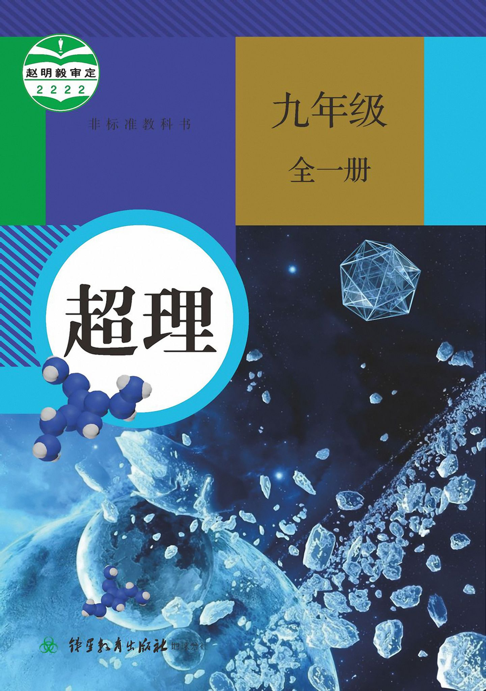

# 超理教材 九年级全一册

本教材由 @ll刘0 编辑，由 @MSI_MS_7102 和 @Admimslrator 整理，第一版出版于 2014 年，由 @珺璟淘米 排版，第二版（本书）出版于 2021 年，由 @超盐酸钠 修复和重新排版。

## 编者的话
根据我个人的了解，一般初次接触超理的人很难迅速对超理形成基本概念，而翻阅超理帖子也没有太大的概念。虽然很多人已经写过类似的教材了，不过我还是打算针对实际中可能出现的问题进行解答，帮助新人快速跨过门槛。

超理学是什么？所谓超理，就是在一定的科学基础上，提出明显荒谬的理论或所谓实验结果，从而达到恶搞、创意的效果。因此，在本贴吧（[超理吧](https://tieba.baidu.com/f?ie=utf-8&kw=%E8%B6%85%E7%90%86)）发布的大多数疑似学术研究的内容都是不可靠的。

该运动主要存在于化学学科，但现在已经几乎扩散到所有的理科。目前，我们还打算向着超文进攻，开创超文哲学，超文学等学科领域。

超理，最早是百度化学贴吧某知名人士“超级理科生”的用户名缩写。该用户过去常在化学贴吧捣乱，发布一些看似恶搞，其实可能是因为知识欠缺和盲目自大引起的内容，严重干扰了正常提问回答的秩序。他的著名错误盐论有：超盐酸（他本人称，该物质为 10 个盐酸分子通过“魔键”构成的）、“𨭦”元素（已经超出周期表）、碱性的酸雨、原子核断裂成粉末吸引电子等。该人的真实姓名可能是**赵明毅**（在超理贴中常出现该名字）。后来，他于 2007 年左右淡出，超理一词的含义演变为“发布像赵明毅那样的盐论”的含义，并且取与“物理学”、“生理学”等相谐的效果，把这些恶搞行为称为“超理学”。

如今，在超理吧发布超理帖子，不仅是对知识的恶搞，更是对赵明毅的再次恶搞。虽然超理学并不是科学，但是超理学也需要与伪科学划清界限。超理学的目的只是为了恶搞，超理贴很容易和一般帖子分辨开来。如标题中注明超理，在帖子中出现大量不切实际的说法或出现赵明毅等字样等。原则上，在学术问题的领域上，如一般讨论贴或百度百科等地方不出现超理内容。而伪科学主要是用于蒙混过关，欺骗其他人来取得某种利益。伪科学故意使得自身与科学难以区分。超理贴吧只讨论超理内容，原则上对于伪科学内容不发布、不讨论，但允许对其进行适当恶搞、超理等。

于是，这就是超理学。要走近超理，大家可以先看看超理贴，找找赵明毅（以及其他人）的事迹（精华区：时代锑星）等，然后可以尝试发布自己的超理学研究成果。如果是有创意的原创超理，就申请精华吧。欢迎加入本吧会员。

下面列出一些超理的特征，仅供参考。

-   出现「强一亿倍」或更多的（魔酸除外）；

-   含“锑”的（魔酸除外）；

-   含有闻所未闻反应条件的，如“发功”；

-   明显有悖于常理的，如“酸性草木灰”；

-   物质化学式明显为某单词的，如“钡碘氘铀”（$\rm{BaIDU}$）；

-   化学方程式将元素符号重组的，如“铜变金”（$\rm{Cu + Ar = Cr + Au}$）；

-   看到某“科学家”当主编达 200 年、2000 年的，肯定是超理。

最后，建议大家不要轻信百度百科的内容。由于权限、政治、商业、积分等等原因，百度百科大部分词条的质量都不尽如人意，这一点在理工、政治类条目上尤为显著。

因此我建议大家使用 Google 搜索，并尽量使用维鸡百科作为参考。缺点是，维百中许多中文条目不够详尽。如果对你的外语水平有自信，你也可以看外语版的维百，目前以英文和德文为佳。
