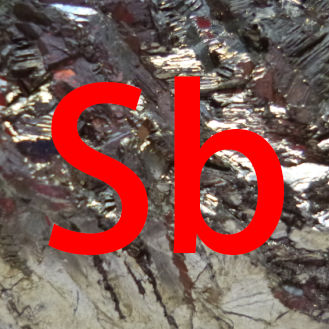

# Markdown 使用说明
Markdown 是一种轻量级标记语言，它允许人们使用易读易写的纯文本格式编写文档。

常用的 Markdown 编辑器有 Typora、Visual Studio Code、Atom 等（均跨平台）。MkDocs 所支持的 Markdown 语法为普通 Markdown 语法的扩展。

## 标题
标题行以若干个 `#` 开头，井号的数量代表标题的优先级。注意除了文档第一行以外，我们一般不用一级标题。

``` md
# 我是一级标题
## 我是二级标题
### 我是三级标题
#### 我是四级标题
##### 我是五级标题
###### 我是六级标题
```

显示效果：
***
<h1>我是一级标题</h1>
<h2>我是二级标题</h2>
<h3>我是三级标题</h3>
<h4>我是四级标题</h4>
<h5>我是五级标题</h5>
<h6>我是六级标题</h6>

***

## 段落格式
在 Markdown 文档中，每两段之间需要用一个空行分隔。同时，Markdown 可以使用以下几种字体格式：
``` md
*斜体*

**粗体**

***粗斜体***

~~删除线~~

<u>下划线</u>

<span class="heimu">谢谢参与</span>
```

显示效果如下：

***
*斜体*

**粗体**

***粗斜体***

~~删除线~~

<u>下划线</u>

<span class="heimu">谢谢参与</span>
***

同时，可以通过在单独的一行中输入 `***` 绘制一个分割线。如果要在灰色的文字上（如脚注）覆盖黑幕，可以使用 `<span class="foot-heimu">`，如下面这个例子：

```
> 这是一个例子：<span class="foot-heimu">114514，1919810！</span>[^1]

[^1]: <span class="foot-heimu">嗯哼哼，啊啊啊啊啊啊啊啊！！！</span>
```

> 这是一个例子：<span class="foot-heimu">114514，1919810！</span>[^1]

## 公式
Markdown 支持 $\LaTeX$ 公式，具体用法分为以下两类：

### 行间公式
行间公式用两个 `$` 包围，公式的两端必须要有一个空格。

如下面的这段话
``` md
由于特殊的结构，超盐酸具有超强的氧化性。

根据赵明毅先生的测算，超盐酸的酸性是魔酸的 3451 万倍，

以至超盐酸气体与氦气在常温下剧烈反应放出 $\rm 9000\;{^\circ}C$ 的高温，

生成二氯化九氦液体，其中氦显 $+\frac 29$ 价。
```

效果如下：

***
由于特殊的结构，超盐酸具有超强的氧化性。

根据赵明毅先生的测算，超盐酸的酸性是魔酸的 3451 万倍，

以至超盐酸气体与氦气在常温下剧烈反应放出 $\rm 9000\;{^\circ}C$ 的高温，

生成二氯化九氦液体，其中氦显 $+\frac 29$ 价。
***

### 独立公式
独立公式一般用于较大的公式，公式必须放在一个或多个单独的行中，用两个 `$$` 包围。

由于 MkDocs 的神秘原理，平时在公式换行时所使用的 `\\` 需要改成 `\\\\`，否则会失效。

如下面这段话
``` md
$$
\begin{aligned}
&\frac{\sin 2x}{2n\cos x}\\\\
=&\frac{\sout{2}\sin x\,\sout{\cos x}}{\sout{2}n\,\sout{\cos x}}\\\\
=&\frac{{\rm si\sout{n}\;}x}{\sout{n}}\\\\
=&{\rm six}\\\\
=&6
\end{aligned}
$$
```

效果如下：
***
$$
\begin{aligned}
&\frac{\sin 2x}{2n\cos x}\\\\
=&\frac{\sout{2}\sin x\,\sout{\cos x}}{\sout{2}n\,\sout{\cos x}}\\\\
=&\frac{{\rm si\sout{n}\;}x}{\sout{n}}\\\\
=&{\rm six}\\\\
=&6
\end{aligned}
$$
***

网站使用 $\KaTeX$ 渲染公式，可能不支持标准 $\LaTeX$ 中的部分关键字，请务必注意。

关于 $\LaTeX$ 如何使用，大家可以自行百度或谷歌。

## 列表
列表分为无序列表和有序列表，无序列表每行以 `+` 或 `-` 或 `*` 开头，有序列表每行以 `x.` 开头（其中 x 为该行的序号），后接一个空格，然后是该行的内容。

无论是无序列表还是有序列表，列表的第一行必须与列表前的最后一行隔开一行，列表的最后一行必须与列表后的第一行隔开一行。

如果列表中某一项需要分行，则两行之间需要空出一行，同时后面的每一行都必须以 4 个空格开头。

下面是一个例子：
``` md
在这个伟大的过程中，硼先生还发表了数十种全新理论。其中一些很重要的理论及研究成果如下：

1. 发现雨水的一般 pH 值应该是在 $9 \sim 10$ 之间；
2. 培养出酸性草木灰；
3. 用 $\rm MnO_2$ 催化 $\rm NH_3$；
4. 重新定义氧化还原反应：

    不含氧的就是还原产物，含氧元素的是氧化产物。

另外，赵明毅大师还致力于改善人类生活。终于找到了把一瓶水喝成五瓶水的方法：

+ 首先到小卖部/副食店
+ 买一瓶康 × 傅茉莉蜜茶
+ 喝一半加一半的水就变成了茉莉清茶
+ 再喝一半后加一半的水就变成了茉莉清茶（无糖版）
+ 再喝一半加一半水就变成了农夫山泉（有点甜）
+ 再喝一半加一半水那就是矿泉水了！
+ 可以喝到五种口味哦！
```

效果如下：
***
在这个伟大的过程中，硼先生还发表了数十种全新理论。其中一些很重要的理论及研究成果如下：

1. 发现雨水的一般 pH 值应该是在 $9 \sim 10$ 之间；
2. 培养出酸性草木灰；
3. 用 $\rm MnO_2$ 催化 $\rm NH_3$；
4. 重新定义氧化还原反应：

    不含氧的就是还原产物，含氧元素的是氧化产物。

另外，赵明毅大师还致力于改善人类生活。终于找到了把一瓶水喝成五瓶水的方法：

+ 首先到小卖部/副食店
+ 买一瓶康 × 傅茉莉蜜茶
+ 喝一半加一半的水就变成了茉莉清茶
+ 再喝一半后加一半的水就变成了茉莉清茶（无糖版）
+ 再喝一半加一半水就变成了农夫山泉（有点甜）
+ 再喝一半加一半水那就是矿泉水了！
+ 可以喝到五种口味哦！
***

同时，列表可以嵌套，被嵌套的列表每一行开头都必须比上一层列表多四个空格。

``` md
1. 第一行
2. 第二行
    + 2.1
	    1. 2.1.1
		2. 2.1.2
	+ 2.2
3. 第三行
```

显示效果：
***
1. 第一行
2. 第二行
    + 2.1
	    1. 2.1.1
		2. 2.1.2
	+ 2.2
3. 第三行
***

## 区块
与列表类似，区块中每一行以 `>` 和一个空格开头。

对于多行区块，每两行之间需要用一个仅包含一个 `>` 的行隔开。

例：
``` md
> “诬蔑？我不在乎，伟人都是这么过来的！”
> 
> “你们将为你们的无知和狂妄而流下悔恨的眼泪，而这些，我都将作为我科学事业道路上的绊脚石。”
```

显示效果：
***
> “诬蔑？我不在乎，伟人都是这么过来的！”
> 
> “你们将为你们的无知和狂妄而流下悔恨的眼泪，而这些，我都将作为我科学事业道路上的绊脚石。”
***

## 代码
代码分为行间代码和代码区块。

### 行间代码
行间代码用两个 <code>&#96;</code> 包围（电脑键盘上 <kbd>1</kbd> 左边的那个按键）。

例：
``` md
无序列表每行以 `+` 或 `-` 或 `*` 开头，有序列表每行以 `x.` 开头（其中 x 为该行的序号）。

在碳正正中，一般使用 `printf` 和 `std::cout` 进行输出。
```

显示效果：
***
无序列表每行以 `+` 或 `-` 或 `*` 开头，有序列表每行以 `x.` 开头（其中 x 为该行的序号）。

在碳正正中，一般使用 `printf` 和 `std::cout` 进行输出。
***

### 代码区块
代码区块以一行 <code>&#96;&#96;&#96; lang</code> 开头，其中 `lang` 为语言，可以是 `cpp`、`py`、`java` 等，也可以省略，以一行 <code>&#96;&#96;&#96;</code> 结尾。

例：
<div class="codehilite"><pre id="114514"><span></span><code>&#96;&#96;&#96; py
a = 1
print("Hello, World!")
&#96;&#96;&#96;
</code></pre></div>

显示效果：
***
``` py
a = 1
print("Hello, World!")
```
***

## 链接
链接格式为：`[链接名称](链接地址)`

例：
``` md
因此，在本贴吧（[超理吧](https://tieba.baidu.com/f?ie=utf-8&kw=%E8%B6%85%E7%90%86)）发布的大多数疑似学术研究的内容都是不可靠的。
```

显示效果：
***
因此，在本贴吧（[超理吧](https://tieba.baidu.com/f?ie=utf-8&kw=%E8%B6%85%E7%90%86)）发布的大多数疑似学术研究的内容都是不可靠的。
***

## 图片
Markdown 中插入图片的格式为：``

其中，`图片地址` 是以当前文件所在的文件夹作为当前目录的。所以，如果要从 `friendly/exmp.md` 调用上一层的 `Antimoney.png`，需要按照以下方式写：

``` md

```

其中 `..` 表示上一级目录。显示效果如下：

***

***

但是，一般在写文档的时候，图片居中、加上注释会好看一些，这时，我们应该这么写：

``` md
<center>
	
	<br>
    <div style="color:orange; border-bottom: 1px solid #d9d9d9;
    display: inline-block; color: #999; padding: 2px;">
    金属锑
  	</div>
</center>
```

显示效果如下：

***
<center>
	
	<br>
    <div style="color:orange; border-bottom: 1px solid #d9d9d9;
    display: inline-block; color: #999; padding: 2px;">
    金属锑
  	</div>
</center>

***

[^1]: <span class="foot-heimu">嗯哼哼，啊啊啊啊啊啊啊啊！！！</span>
