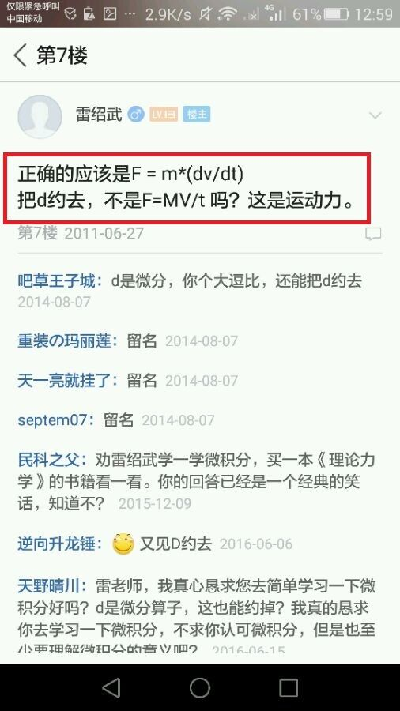
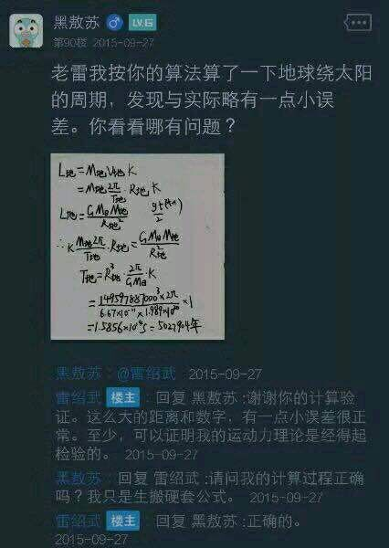
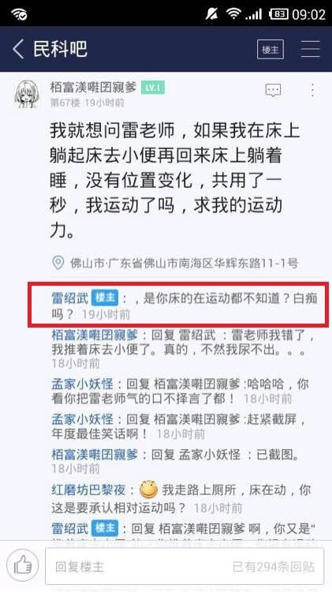
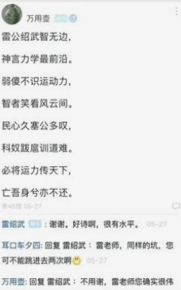

# 雷论：总集
雷论，即超理学家雷绍武先生提出的理论。理论非常“雷人”，又是雷氏族人所作，故得“雷论”之名。[^0]

**注意：受说不准原理影响，雷先生的言论可能在一般人看来有前后不一致之处；但这并不是雷论的错误，而是因为读者智商过低，无法理解雷论的精髓。**

## 0. “运动力”理论
1. 力是物体运动的原因，称之为“运动力”。

2. 运动力大小只和物体质量和速度有关。

3. 运动力公式 $L=kmv$，其中 $k=1\times\rm s^{-1}$。对于 $k$，雷绍武解释道：“这代表运动的时间为 1 秒。”（注：雷绍武认为秒是最小的时间单位，而且只能研究整数秒的运动）
   
   	*雷绍武给出运动力公式 $L=mv$，被吧友嘲笑质疑量纲不对。为了纠正量纲错误，雷绍武才在公式中加入一个常量 $k$。*

4. 雷绍武得到了运动力公式以后，随意推广。雷绍武认为在镭星无需区分“正相关”“正比”“相等”，提出了一些锑理论，比如：
    1. 当物体运动力大于摩擦力时，物体开始运动。
    2. 行星绕恒星运动时，引力 = 运动力。

详见：运动力学讲解

## 1. 约 "d"

雷绍武先生在早期不止一次说过，微分运算中的 "d" 应该约去。后期雷先生精简了理论，不承认微分，认为运动力没有 "d"，写 "d" 这个字母是错误的。但大多他的学生依然坚持约 "d" 观点。

应用：自从有了约 d 大法，万事万物皆可约。如 $\frac {\sin x}{n}=\text{six}=6$，$\frac {\cos i}{c}=\text{osi}=\text{iOS}$。

	
	 
    

    先有雷神后有天，微分约 d 惊破天
  	

## 2. 四则运算，大道至简
雷绍武认为，四则运算最简单，根据“大道至简”的思想，四则运算可以解决物理学中遇到的一切数学问题，是唯一可以用的数学工具。因此，一切应用其他运算的理论就都错误了。

应用：如果有谁敢质疑约 d，就告诉他我们只承认四则运算，所以 d 必须约去，也必然约去。

## 3. 除法结合律
雷绍武在计算 $10\div 1\div 10$ 时得到结果 100。雷绍武在后来的解释中认为，$10\div 10$ 才是1，如果有 $10\div 1\div 10$，必然要先用结合律变换成 $10\div(1\div 10)$ 才能计算。

应用：$(10\div 1\div 10)\text{ 元}=1\text{ 元}$，$[10\div (1\div 10)]\text{ 元}=100\text{ 元}$，所以 $1\text{ 元}=100\text{ 元}$，以此类推，官科货币体系也是错误的。

## 4. 无理数不存在
有人问雷绍武数轴上取到无理数几率是多少，雷绍武回答说数轴没有无理数，所以几率是 0。

应用：因为无理数不存在，所以 $\pi$，$e$ 等等都是错误的，所以圆是错误的，球也是错误的，所以打球是错误的，地球也应该严正声明一下自己的形状不是球，计算体积应该用刻度尺慢慢测量。

## 5. 重力加速度是 $\rm 4.9\;m/ss$
首先是单位，雷绍武认为四则运算统治一切所以平方是错误的，后面写成了"ss"（元首？）。数值方面，原本雷绍武认同 9.8；但后来他早前做的扔石头实验的录像被找到，贴吧上有人分析发现：按照运动力理论得出的公式，会得到一个和 9.8 相差甚远的 $g$ 值。后来雷绍武几次修改公式，最后版本中把 $g$ 值定为 4.9，终于让他的公式在第一秒（$t=\rm 1\;s$）时推得的结论和牛顿力学公式完全一致，得到了正确的结论。

应用：课文《雷乙己》片段：

雷绍武一到贴吧，所有发贴的人便都看着他笑，有的叫道，“雷绍武，你的 $g$ 又改成新数值了！”他不回答，对吧主说，“发两个贴，要一个‘正确的’。”便排出九元大钱。他们又故意的高声嚷道，“你一定又改了人家的重力加速度了！”雷绍武睁大眼睛说，“你怎么这样凭空编人理论......”“什么理论？我前天亲眼见你改了 $g$ 的取值，被吧友吊着打。”雷绍武便涨红了脸，额上的青筋条条绽出，争辩道，“调整不能算改......调整！......民科人的事，能算改么？”

## 6. 地球公转周期五百万年
**@黑敖苏**：老雷我按你的算法算了以下地球绕太阳的周期，发现与实际略有一点小误差。你看看哪有问题？

$$
\begin{aligned}
& L_{\text{地}} = M_{\text{地}}v_{\text{地}}k = M_{\text{地}}\frac{2\pi R_{\text{地}}}{T}k\\\\
& L_{\text{地}} = \frac{GM_aM_{\text{地}}}{R_{\text{地}}^2}, k = {\rm 1\;s^{-1}}\\\\
& \therefore \frac{2\pi kM_{\text{地}}R_{\text{地}}}{T} = \frac{GM_aM_{\text{地}}}{R_{\text{地}}^2}\\\\
& \therefore T = 5027904\;(\text{年})
\end{aligned}
$$

**雷绍武**：回复 **黑敖苏**：谢谢你的计算验证。这么大的距离和数字，有一点小误差很正常。至少，可以证明我的运动力理论是经得起检验的。

**黑敖苏**：回复 **雷绍武**：请问我的计算过程正确吗？我只是生搬硬套公式。

**雷绍武**：回复 **黑敖苏**：正确的。

后期雷绍武表示这运算不是他算的，所以他不对此负责。并且搬出了一套新计算，计算中他依靠已知的地球公转周期和百度的地球公转轨道长度求出了地球公转速度，除得地球公转周期。后期结论还有很好的兼容性，将我们平日认知的一年和五百万年，代进去照样成立。所以雷老师的学生们常常陷入深思：为什么代入五百万年和一年都能成立？

应用：由于雷绍武的地球公转周期是五百万年，所以雷绍武的寿数应该按亿年计算。

由于百分之几个亿的误差都是可以忽略不计的，所以运动力理论出现任何错误都可以回答“一点点误差而已，完全可以忽略不计”。$g$ 取值是多少？$10\div 1\div 10$ 是多少？管他呢～反正一忽略不计，结果立刻正确～

	
	 
    

    传说中的万年公转
  	

## 7. 地球自转周期 37 年
有人问雷绍武周期 37 年的卫星是不是地球的同步卫星，雷绍武说“是”。所以地球自转周期是 37 年。

应用：常常与“公转周期五百万年”，“一点点误差可以忽略”连用。还可以化用正确的谢谢句式，无论雷绍武说过什么，都矢志不渝地相信，并回答“五百万年的，谢谢”“三十七年的，谢谢”，以强调其理论的正确。

## 8. 时间量子化
雷绍武认为，时间是量子化的，最小时间单位是一秒；讨论 0.5 秒的时间没有意义，大错特错。因而他的理论也只能一秒一秒计算，雷绍武声称只有“一秒是一秒”地计算，才能“没有一点点误差，完全正确”。

应用：所以那些百米飞人的比赛完全没有意义，只要跑进十秒就都应该算平手。

## 9. 人不动床动
有人质疑雷绍武的时间量子化观点，提出问题“若我从床上起来去卫生间，一秒内回到床上，我动没动？”雷绍武回答：“是你的床在运动，不知道？”此后这段故事被简化成“人不动床动”五个字，成为雷绍武圈提到就会引发大笑的笑话。

应用：时有风吹幡动，一僧曰风动，一僧曰幡动，议论不已。绍武进曰：“不是风动，不是幡动，是你床在动。”

	
	 
    

    雷老师提出先进超理理论——人不动床动，却被无知的碲球人无情嘲讽。
  	

## 10. 加速度理论
**“一个雷的运动力可以让一千克物体一秒运动一米”——雷老师原话**

**@若安逸丶**：请问两个人 100 米赛跑，假如一个人一开始就是 $\rm 10\;m/s$，另一个人一开始从零加速到 $\rm 10\;m/s$，问谁先到达终点？雷老师，虚心请教。

**雷绍武**：回复 **若安逸丶**：肯定是另一个人一开始从零加速到 $\rm 10\;m/s$，先到达终点。这只是数字游戏，实际上是不可能的。

**@zzcbb66**：快截图

**@369追猎者**：神回复

**@盲流国际**：回复 **雷绍武**：雷绍武，你能蠢成这样，也真是不容易

应用：雷论[第 5 条](#5-rm-49mss)“重力加速度是 $\rm 4.9\;m/ss$”，0755 83535000 语录第 118 条“实验证明 $g=\rm 5\;m/s$”。0755 大师和雷老师未曾谋面，竟然做了同样的实验，并得出了同样的结果！多么浪漫的一段超理学史啊！

	
	 
    

    雷老师再次遭到愚蠢的网友的讥笑。
  	

## 11. 雨滴砸死人
雷绍武认为雨滴可以砸死人，打伞可以避免被砸死。雷绍武也是淋过雨的，在几十年的风风雨雨之中练就了不会被雨滴砸死的功夫。“他说风雨中，这点痛算什么......”一句肯定是为雷老师而作的！[^1]

应用：按照运动力理论，雨滴都可以砸死人，光的 $v$ 很大，而且按照运动力理论光由“电子”组成，只要光一照上去，肯定立刻压扁一切。所以读者们不要使用手电筒，以免不小心被弹上天。

## 12. 金无赤足
雷绍武认为：“金无足赤”该作“金无赤足”更加妥当。并宣称“赤足”没错。“高徒”们为了帮老师证明“赤足”正确，在浩如烟海的网上资料库里找到了其他人使用“赤足”表达的记载。

应用：由上可以推得：一个汉语双音节词汇，字序颠倒，语义不变。如“雷老师在车上被割了*皮包*”等。

## 13. 雷神弱智民科必亡
雷绍武至今写了六百多首《咏雷》，内容全部是自己夸自己。不过《咏雷》系列不少都不是雷绍武自己写的，而是学生们自发投稿，雷绍武选择性收录。看不下去的反对者见此则写藏头诗明褒暗贬。其中最著名的便是这首“雷神弱智民科必亡”，初次发布时雷绍武还对作者表示感谢，被人拆穿笑话了一番；后又有人发布时雷绍武竟再次感谢作者，同一首诗居然成功了两次！

应用：如果读者愿意也可以写一首诗。不过雷绍武现在有所警惕，收入《咏雷》诗集前或许会把藏头的字改了，如“雷绍武智力**不**正常”改为“雷绍武智力**太**正常”。

## 14. 肉原子理论/创新电子理论
早期，雷绍武认为一切物质由原子组成，什么物质就由什么原子组成。肉由肉原子组成，饭由饭原子组成，汤由汤原子组成......后期雷绍武把“原子”改成“电子”，但他所谓电子其实内涵和原子没大区别，甚至还抄袭借鉴了官科的元素周期表。

应用：按照肉原子理论，不仅仅是遍地都是核反应的问题，而且许多事情搞不清楚。雷绍武全部由人原子组成，可是他的脑袋又是脑原子组成的，那么雷绍武脑袋里的东西究竟是人原子还是脑原子还是别的什么呢？是不是改一个名字就立刻核爆炸了呢？没人说得清楚。不过至少我们可以肯定创新电子理论的价值，因为他至少把元素周期表改了个名字，不至于产生肉原子究竟什么时候变成排泄/排遗物原子的哲学问题。

详见：创新电子理论

## 15. 小号自吹
雷绍武曾经发表一篇以其他人的口吻写的自夸文章，后又回个谢谢楼主。估计雷绍武是忘换小号，结果变成自己谢自己，引来众雷黑攻击。虽然删贴，但早已被人截图，根本无法抵赖。

应用：雷绍武经常宣称反对他的“只有几个人”，都是这些人“开小号”故意装作声势浩大。而此时反对者便会拿出截图，一把将雷绍武拉下道德高地一起混战。

## 16. “看看楼主，空虚之极！恐惧之极！泼妇骂街，无耻之极！”
雷绍武曾使用这个句式回复自己开的贴，结果立刻被截图传开。

应用：雷老师的信徒们自发组织了合唱团，或称唱诗班。只要雷绍武发贴，信徒们立刻齐唱这句词，其整齐划一堪比“正确的谢谢”。甚至还有人开发出“和声”玩法，只要看见雷绍武发贴，一声部唱“看看楼主”，二声部唱“空虚之极！”......如此下去。

## 17. 细胞里面有细胞
雷绍武断定单细胞生物不存在，尔后吧友拿出草履虫图，动物植物细胞图，雷绍武均称细胞由大量细胞构成，甚至认为草履虫的伸缩泡是一个器官，里面有神经。

应用：只要有一个细胞，就可以使用雷氏生物学变出无穷多个细胞。唯一的问题在于欧几里得空间可能装不下这么多细胞，由此可以判断雷绍武应该是无限维的希尔伯特空间中的存在。

## 18. 微波炉射电子
雷绍武和自称是电子科技大学教授的人曾经展开过一场大论战，其中教授要雷绍武解释微波炉工作原理，雷绍武认为微波炉靠往食物里发射电子加热食物。

应用：根据创新电子理论，任何发射光频段电磁波的设备都在射电子，所以为了防止被电爆，建议大家立刻关闭计算机，停止浏览这篇文章，躲入铅板房间。

## 19. 喷水式飞机
雷绍武主张飞机飞行时可以通过漏油加速，换句话说飞机只要往外恰当地喷油就可以飞了。后来或许是考虑到油比较贵，有人提出了改进方案：喷水式飞机。

应用：不仅飞机要喷水，床上也要常备水桶，毕竟紧急时刻很难做到[人不动床动](#9)，但是如果能及时倒下去一桶水......

## 20. 地球绕柱
雷绍武认为地球不是绕地轴转，而是“和轴一起转”，并且认为地球仪是错误的。不过或许是打字错误，雷绍武居然说出了“地球和柱一起转动”这种匪夷所思的话。大概他认为地轴真的是指地球仪的那根“柱”吧。

应用：既然地球是绕柱转，那么轴就是错误的。一切轴都应该换成柱，轴对称 = 柱对称，轴承 = 柱承，轴矢量 = 柱矢量，坐标轴 = 坐标柱......并且我们可以确定共工反对雷绍武，如果他没有撞不周山，天柱不折，那么就可以完美地证明官科错误。

## 21. 时间点不是一个独立的点
雷绍武认为，1 点是 1 小时，所以 12 点比 10 点多两个小时，即 12 点是 12 个小时，因此时间点不是一个独立的点。[^2]

应用：雷老师早上八点吃早饭，所以雷老师吃了八小时早饭；我在 11 点钟做出此编辑，所以我编辑这个词条用了 11 小时。

## 22. 万有引力定律是错误的
雷绍武认为：

1. 引力不是两个物体之间的相互作用才产生的引力。
2. 引力是物质的本质属性。只要物质存在，引力就存在。引力大小和范围跟质量成正比，跟距离成反比。
3. 万有引力定律 $F=(G\times M_1\times M_2)/R^2$ 对两个静止物体之间的引力有可能适用。但是，对运动的公转天体是不适用的。因为任何公转天体之间的引力都大于静止天体之间的引力。因此，用万有引力定律公式计算公转天体之间的引力是错误的。
4. 公转天体的运动力 $L=kmv$ 平均起来是 = 中心拉力（引力）并且垂直的。否则，这个公转天体就不可能长期存在。

## 23. “$0.999\dots\ne1$”
雷绍武认为，在数学上，1 就是 1，$1=1$，这是绝对的。任何 $>1$ 或 $<1$ 的数都不是 1，因此：说 $0.999\dots =1$是错误的。

## 24. 雷氏热学理论
详见：雷氏热学创新理论

## 25. 著作《宇宙探秘》
参见：《宇宙探秘》

## 26. 雷绍武论战争
战争的胜利是运动力的胜利

1. 战争的胜利是运动力的胜利。
2. 运动力大的，一定战胜运动力小的。
3. 从古到今，没有运动力，什么胜利都没有。[^3]

## 27. 太阳新定义
什么是太阳？

1. 一切发光发热的天体都叫太阳。
2. 每一个太阳的体积不同，物质不同，年龄不同，远近不同，发光发热的强度不同。
3. 人不可能造星球那样大的太阳。但是，可以制作蜡烛，电灯，火炬，篝火，高炉等发光发热的小小小儿的太阳。
4. 发光发热的原理都是相同的：物体达到一定温度和燃点时，电子电能转换成热能和光能。部分电子转换成光子。
5. 一切岩石类星球，都是太阳物质冷却后的残骸。[^4]

## 28. 量子不存在
雷绍武认为量子并不存在，不能再分割的最小物质是电子，电子构成不同的分子物质[^5]。尽管按照他的说法，雷氏力学中的量子就是电子[^6]。

## 29. 其他贡献
### 语文
+ 《念奴娇·赤壁怀古》中的“羽扇纶巾”指诸葛亮。

### 数学
+ 数与数或者数与字母连写是表示同一个数的两个数位，如当 $x=3$ 时，$5x=53$。

### 地理
+ 冬天地球离太阳远。
+ 全球季节是等时的。

### 物理
+ 两球做等高的自由落体运动，大球先落地。
+ 物质由电子构成，电子有 N、S 极。
+ 物理中分数不能约分，如物体在 $\rm 2\;s$ 内位移为 $\rm 10\;m$，则平均速度是 $\rm 10\;m/2\;s$，不能写作 $\rm 5\;m/s$。

### 化学
+ 一氧化氮和氮化硼是二聚分子。

[^0]: 大部分内容可查证于知乎用户张从谨所整理的文章中：[https://www.zhihu.com/people/zhang-cong-jin-1/posts](https://www.zhihu.com/people/zhang-cong-jin-1/posts)
[^1]: [歌曲《水手》](https://www.bilibili.com/video/BV1zv411q7CG)
[^2]: 原帖：[https://tieba.baidu.com/p/7041844423](https://tieba.baidu.com/p/7041844423)
[^3]: 原帖：[战争的胜利是运动力的胜利-雷氏力学吧](https://tieba.baidu.com/p/7205054768)
[^4]: 原帖：[什么是太阳？-雷氏力学吧](https://tieba.baidu.com/p/6968912556)
[^5]: 原帖：[宇宙中不存在量子这种物质-雷氏力学吧](https://tieba.baidu.com/p/7234797423)
[^6]: 一个物理量如果存在最小的不可分割的基本单位，则这个物理量是量子化的，并把最小单位称为量子。可参加锑度百科的量子条目：[量子-锑度百科](https://baike.baidu.com/item/%E9%87%8F%E5%AD%90)
